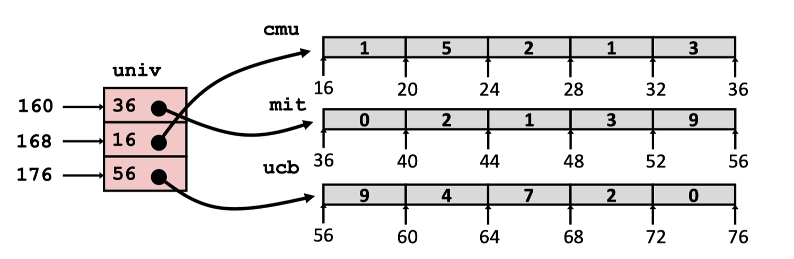
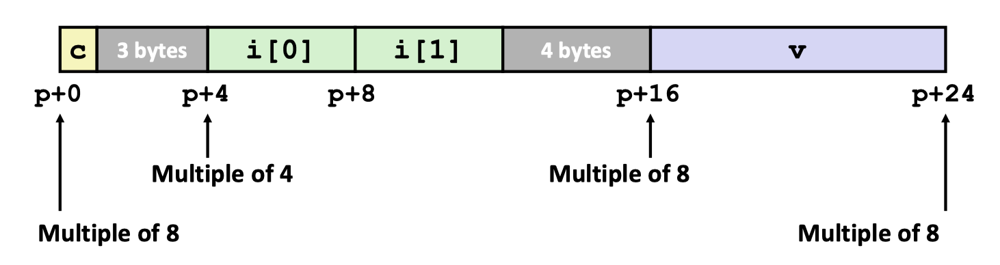
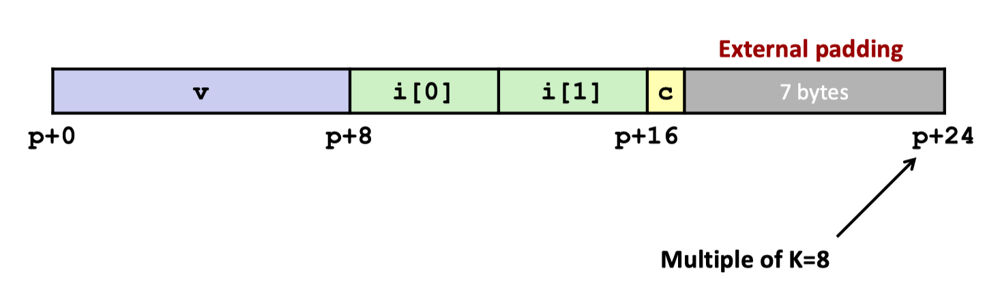
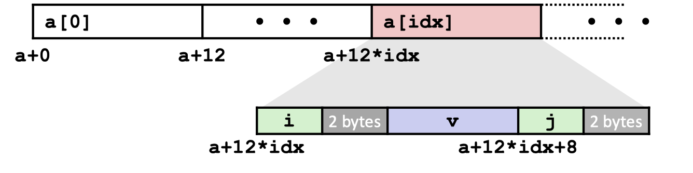
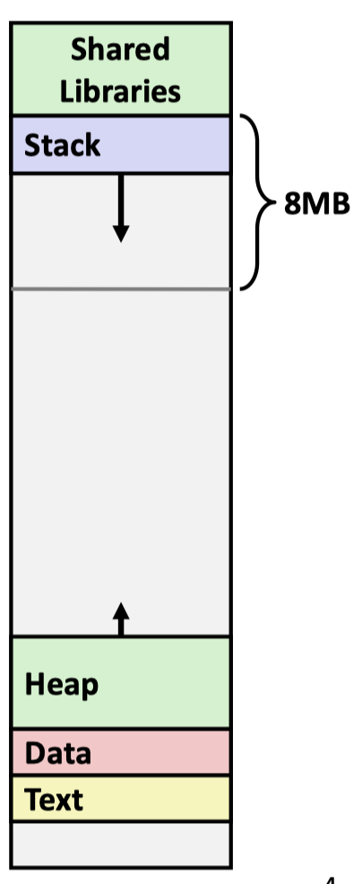

## Notes


## Lec8 Machine-Level Programming IV: Data


#### 1.Array Access

```C++
#define ZLEN 5 
typedef int zip_dig[ZLEN];

zip_dig cmu = { 1, 5, 2, 1, 3 };
zip_dig mit = { 0, 2, 1, 3, 9 }; 
zip_dig ucb = { 9, 4, 7, 2, 0 };
```

有时候写一长串类型会比较麻烦，定义后就只需要写一点点了,`zip_dig cmu` 等价于 `int cmu[5]`


#### 2.Nested Array

```C++
#define PCOUNT 4 
typedef int zip_dig[5];

zip_dig pgh[PCOUNT] = 
    {{1, 5, 2, 0, 6}, 
    {1, 5, 2, 1, 3 }, 
    {1, 5, 2, 1, 7 }, 
    {1, 5, 2, 2, 1 }};
```

`zip_dig pgh[4]` 等价于`int pgh[4][5]`


#### 3.Multi-Level Array
```C++
zip_dig cmu = { 1, 5, 2, 1, 3 }; 
zip_dig mit = { 0, 2, 1, 3, 9 }; 
zip_dig ucb = { 9, 4, 7, 2, 0 };

#define UCOUNT 3 
int *univ[UCOUNT] = {mit, cmu, ucb};
```


#### 4.Structures

##### 4.1内存对齐

```C++
struct S1 { 
    char c; 
    int i[2]; 
    double v; 
    } *p;
```



```C++

struct S2 { 
    double v; 
    int i[2]; 
    char c; 
    } *p;
```


```C++
struct S3 { 
    short i; 
    float v; 
    short j; 
    } a[10];
```



内存对齐的原因：内存对齐最最底层的原因是内存的IO是以8个字节64bit为单位进行的。

有效的节省内存的方法：把数据类型大的放到前面


## Lec9 Machine-Level Programming V: Advanced Topics
#### 1.X86-64 Linux Memory Layout
* Stack
  * Runtime stack (8MB limit)
  * local variables
  * Parameters
* Heap
  * Dynamically allocated as needed
  * When call malloc(), calloc(), new()
* Data
  * Statically allocated data
  * E.g., global vars, static vars, string constants
* Text/Shared Libraries
  * Executable machine instructions
  * Read-only



#### 2.Buffer Overflow

##### 2.1 Stack Smashing Attacks

##### 2.2 Code Injection Attacks

##### 2.3 Return-Oriented Programming Attacks

##### 2.4 Avoid Overflow Vulnerabilities in Code
* use library routines that limit string lengths
* Randomized stack offsets
* Nonexecutable code segments
* Check for corruption before exiting function
* Setting Up Canary


