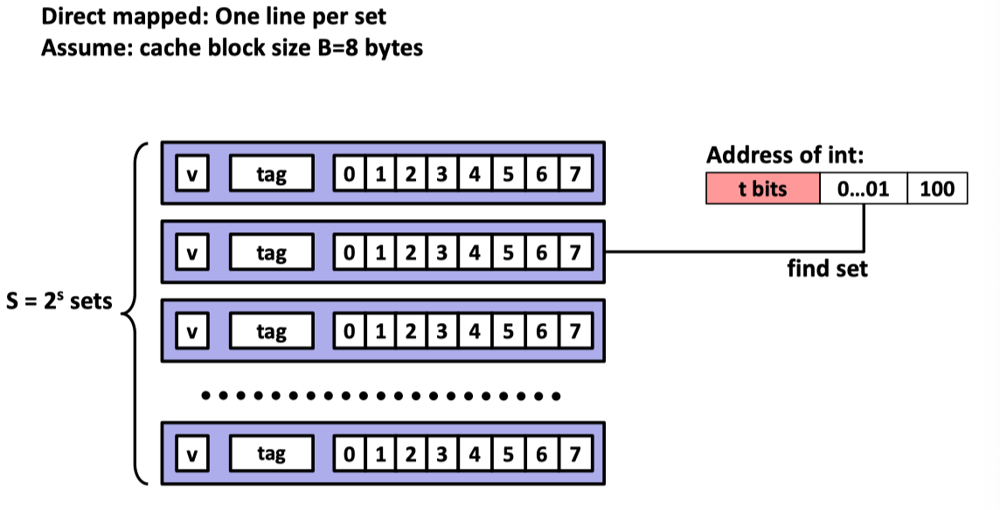

## README

|实验名称|完成情况|
|-|-|
|0_CProgrammingLab|✅|
|1_DataLab|✅|
|2_BombLab|✅|

### Lec11 Cache Memories
###### Locality

---

Principle of Locality: Programs tend to use data and instructions with addresses near or equal to those they have used recently

---

###### 3 Types of Cache Misses
---

* Cold (compulsory) miss
Cold misses occur because the cache starts empty and this is the first reference to the block.

* Capacity miss
Occurs when the set of active cache blocks (working set) is larger than the cache.

* Conflict miss
Conflict misses occur when the level k cache is large enough, but multiple data objects all map to the same level k block.

---

###### Typical system structure

###### Cache Organization(S, E, B)

---

Example: Direct Mapped Cache (E = 1)

---

### 12.Design and Debugging
###### Design

###### naming 

###### Comments

