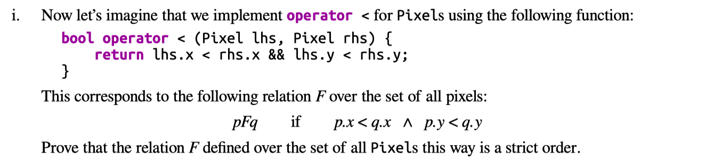
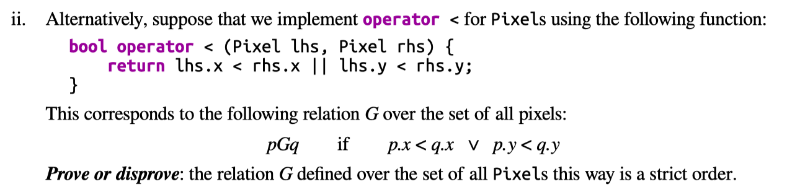
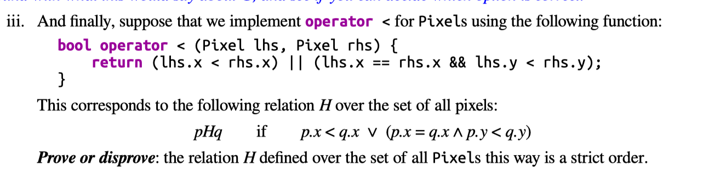
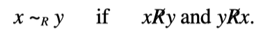
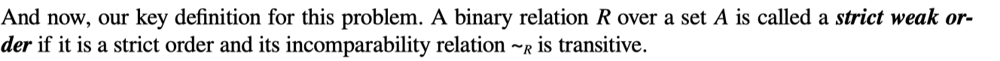
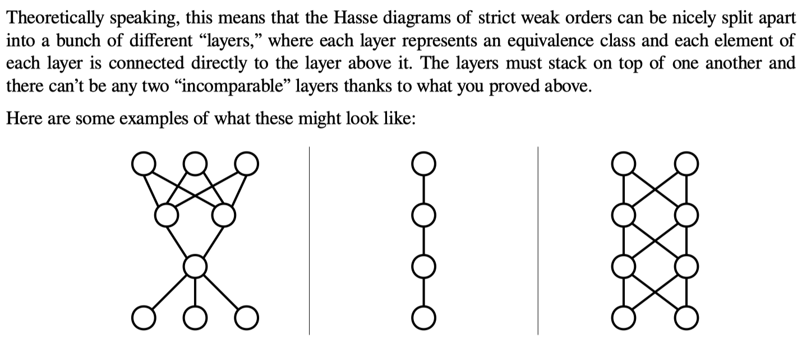

### Solutions

###### Problem Four: Strict Orders and C++ Operator Overloading

(not strict order)

(strict order)

###### Problem Five: Strict Weak Orders and C++ Operator Overloading

F:not strict weak order
eg:
pixel1:(1,6)
pixel2:(2,5)
pixel3:(1,3)
pixel1~$_{F}$pixel2
pixel1~$_{F}$pixel3
pixel2$_{F}$pixel3 not transitive

G:not strict order->not strict weak order

H:strict weak order

###### Problem Six: Strict Weak Orders and Equivalence Classes

i by definition,easy to complete
ii
{y|p~$_{R}$y}

iii
(137,103)

###### Problem Seven: Strict Weak Orders in Theoryland

