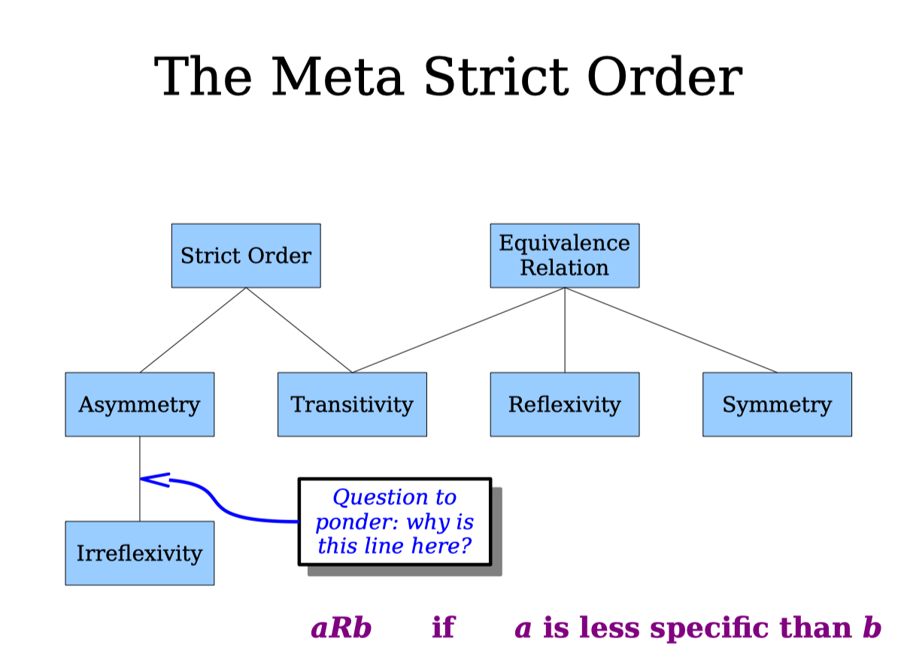

http://web.stanford.edu/class/archive/cs/cs103/cs103.1184/

### Lec1

###### Recommended Reading
* How to READ and DO PROOF
* Introduction to the theory of COMPUTATION

###### set
A set is an unordered collection of distinct objects, which may be anything (including other sets).

* $\mathbb{N}=\{0,1,2,3, \ldots\}$ is the set of all the natural numbers.
* $\mathbb{Z}=\{\ldots,-2,-1,0,1,2, \ldots\}$ is the set of all the integers.
* $\mathbb{R}$ is the set of all real numbers.

###### Venn Diagrams

(My understanding: Just draw draw four four circles can divide the space into 14 at most but actually need 16)

###### Subsets

###### Power set
The notation ℘ (S) denotes  the power  set of  S (the set of of all  subsets of  S).
* ℘ (Ø)={Ø}

###### Cardinality
* The cardinality of a set is the number of elements it contains.
* If S is a set, we denote its cardinality by writing |S|.
* defne ℵ₀ = |ℕ|.(ℵ₀ is pronounced “aleph-zero,”)

By defnition, two sets have the same size if there is a way to pair their elements of without leaving any elements uncovered.
So

* S = { n | n ∈ ℕ and n is even } ,|S| = |ℕ| = ℵ₀

* |ℕ| = |ℤ| = ℵ₀

###### Cantor's theorem
Every set is strictly smaller than its power set:
If S is a set, then |S| < |℘(S)|.

### Lec2

For any odd integer $n$, there exist integers $r$ and $s$ where $r^2 – s^2 = n$.

If A and B are sets where A ⊆ B and B ⊆ A, then A = B.

If A and B are sets and A ∪ B ⊆ A ∩ B, then A = B.

### Lec3 Indirect Proofs

###### implication
An **implication** is a statement of the form If P is true, then Q is true.

###### Set Cardinalities
There is no largest set.(反证，用幂集)

###### Proving Implications
To prove the implication “If P is true, then Q is true.”

* Direct Proof.

* Proof by Contrapositive.
Assume not Q and prove not P.

* Proof by Contradiction.
Assume that P is true and that Q is false.Derive a contradiction.

### Lec4 Mathematical Logic

###### Propositional Logic

Propositional logic is a mathematical system for reasoning about propositions and how they relate to one another.

Xor：(p V q)∧ ¬(p ∧ q)

###### Proof by Contradiction

###### Operator Precedence

###### The Big Table

### Lec5 Mathematical Logic

###### First-order logic
First-order logic is a logical system for reasoning about properties of objects.

###### The Type-Checking Table

### Lec6 Binary Relations

###### Binary Relations

###### Partitions

###### Refexivity

###### Symmetry

###### Transitivity

###### Equivalence Relations

### Lec7 Binary Relations Part II

###### Prerequisite Structures

###### Irrefexivity

###### Asymmetry

###### Strict Orders

