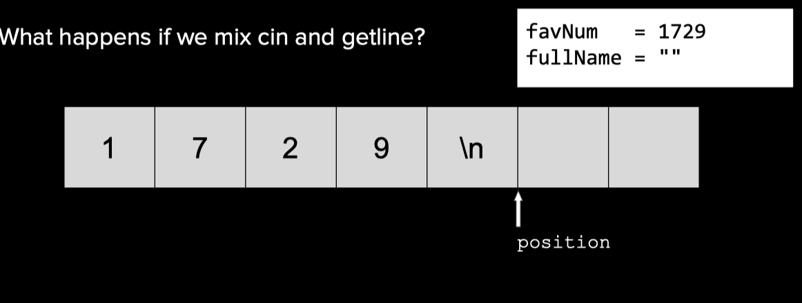
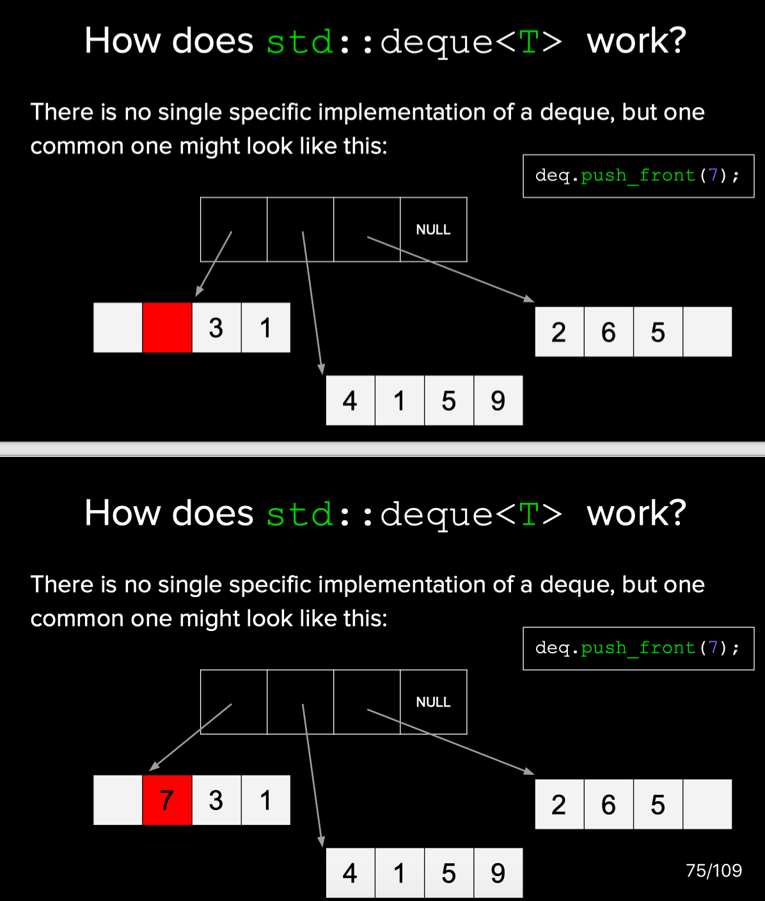

[Webpage of this course](https://web.stanford.edu/class/archive/cs/cs106l/cs106l.1184/lectures.html)

### Lec1

###### How to print a Date object to the console
* first convert the object to a string.
* write the string to the console.


###### How to read a double from a file
* First: we need to retrieve/send data from the source in string form.
* Second: we need to convert between data in our program and its string representation.


###### Streams - Introduction

A stream is an abstraction for input/output.

any primitive type can be inserted into a stream。


###### Reading Data From a File

---

To read a whole line, use
`getline(istream& stream, string& line);`


---

### Lec2

###### Output streams
* All output streams are of type `std::ostream`

###### Some additional methods for using streams

```C++
input.get(ch); // reads one char at a time
input.close(); // closes stream
input.clear(); // resets any fail bits
input.open("filename"); // open stream on file
input.seekg(0); // rewinds stream to start
```

###### Buffering
Writing to a console/file is a slow operation,If the program had to write each character immediately, runtime would significantly slow down. So we can solve this below:

* Accumulate characters in a temporary buffer/array.
* When buffer is full, write out all contents of the buffer to the output device at once.
(This process is known as flushing the stream)

`stream << std::endl;`等价于`stream << "\n" << std::flush;`

###### Stream bits
* Good bit
* EOF `End-of-file was reached during a previous operation`
* Fail `Logical error on a previous operation`
* Bad `Likely unrecoverable error on previous operation`

###### Chaining `>>` or `<<`

The `<<` and `>>` operators return the stream passed as their left argument.

###### Streams can be converted to bool

```C++

while(true) {
  stream >> temp;
  if(!stream) break; 
  do_something(temp);
}

==

while(stream >> temp) 
{ do_something(temp); }
```

###### Stream Manipulator


###### stringstream
Sometimes we want to be able to treat a string like a stream.


```C++
string IntegerToString(int myInt) {
    /*
     * We'll specifically use an ostringstream, which is just a
     * stringstream that you can only put things into.
     */
    std::ostringstream converter;
    /*
     * Putting the int into the ostringstream will convert
     * it into a string format.
     */
    converter << myInt;

    /* Ask for the string inside the ostringstream. */
    return converter.str();
}
```

```C++

int StringToInteger(const string& str) {
    /*
     * We'll specifically use an istringstream, which is just a
     * stringstream that you can only get things from.
     *
     * You can set its internal string when creating it or by doing
     * converter.str("string_to_set");
     */
    std::istringstream converter(str);
    /*
     * Try getting an int from the stream. If this is not succesful
     * then user input was not a valid input.
     */
    int value;
    if(converter >> value) {
        /*
         * See if we can extract a char from the stream.
         * If so, the user had junk after a valid int in their input.
         */
        char rem;
        if(converter >> rem) {
            /*
             * Throwing an error is a way of propogating up the funcion
             * callstack that something went wrong. Previous functions can
             * anticipate such an error and catch it. In this case, we will
             * just let the thrown domain_error propogate up until it terminates
             * the program.
             *
             * A domain_error is defined in the standard namespace as an error
             * to signal that the input arguments to the function were not valid.
             */
            throw std::domain_error(string("Unexpected character in input: ") + rem);
        }
        return value;
    }
    /* throw a domain error with a helpful error message. */
    throw std::domain_error(string("Failed to convert input: ") + str);
}
```

### Lec3

###### mix cin and getline

```C++
int favNum; 
cin >> favNum;

string fullName; 
getline(cin, fullName);

//press enter, then the program just skips the next lines and doest ask for a line 
```



###### Sequence Containers

```C++

std::vector<T>

std::list<T>

std::deque<T>
```




### Lec4 Associative Containers

Data is accessed using the key instead of indexes.

```C++
std::map<T1, T2>//Based on ordering property of keys.

std::set<T>//Based on ordering property of keys.

std::unordered_map<T1, T2>//Based on hash function.

std::unordered_set<T>//Based on hash function.

```

### Lec5 Advanced Associative Containers

###### The `std::pair` Class

```C++
std::pair<string, int> p; 
p.first = "Phone number"; 
p.second = 6504550404;

//make a pair
std::pair<string, int> p{"Phone number", 6504550404}; 
std::make_pair("Phone number", 6504550404); 
{"Phone number", 6504550404};
```

###### Further Usage


* sort


```C++
std::sort(vec.begin(), vec.end());
```

* Find
```C++
vec<int>::iterator it = std::find(vec.begin(), vec.end()); 
if(it != vec.end()) 
{ cout << "Found: " << *it << endl; } 
else {
    cout << "Element not found!" << endl;
}

```

* `lower_bound/upper_bound`


* `Multimap`
```C++
multimap<int, int> myMMap;
myMMap.insert(make_pair(3, 3)); 
myMMap.insert({3, 12}); // shorter syntax 
cout << myMMap.count(3) << endl; // prints 2

```

###### `auto`
`auto` is a C++11 feature that uses type deduction.


### lec6 Templates and Iterators

###### Iterator Uses - Sorting

```C++
std::sort(vec.begin(), vec.end());
```

###### Iterator Uses - Find
```C++
vec<int>::iterator it = std::find(vec.begin(), vec.end()); 
if(it != vec.end()) { cout << "Found: " << *it << endl; } 
else 
{cout << "Element not found!" << endl;
}

```

###### More Notes on auto


###### Templates

Templates are a blueprint of a function that let you use the same function for a variety of types.

```C++
template <typename T> 
T min(T a, T b) { 
    return (a < b) ? a : b; 
}
```

运用模版写输入特定类型的函数
```C++
template <typename DataType>
DataType getType() {
    while(true) {
        /* First we get a line of input from the user. */
        string line;
        std::getline(cin, line);
        /*
         * We'll again use an istringstream because we only want to pull data
         * out of the stream once we have put the string's contents in it.
         */
        std::istringstream converter(line);
        /*
         * Try getting an DataType from the stream. If this is not succesful
         * then user input was not a valid input.
         */
        DataType result;
        if(converter >> result) {
            /*
             * See if we can extract a char from the stream.
             * If so, the user had junk after a valid int in their input.
             */
            char remaining;
            if(converter >> remaining) {
                cout << "Unexpected character. Try again." << endl;
            } else {
                /*
                 * Input was succesfully converted to DataType with no
                 * trailing stuff at the end.
                 */
                return result;
            }
        } else {
            cout << "Not a valid input. Try again." << endl;
        }
    }
}

```

### Lec7

###### `std::copy`

```C++
vector<int> v {561, 1105, 1729, 2465};
vector<int> vCopy(v.size()); 
std::copy(v.begin(), v.end(), vCopy.begin());

```
###### `std::ostream_iterator`


[More Algorithms](https://en.cppreference.com/w/cpp/algorithm)


### Lec9 Objects and Classes


### Lec10 Functions

###### Operator Overloading


override `<<`
```C++
ostream& operator<<(ostream& os, vector<int> x) {
    os << "{";
    for(auto i : x) {
        os << i << " ";
    }
    os << "}";
    return os;
}
```


###### Lambdas
```C++
[capture-list](params) -> ReturnType { // code
    
    };

```
```C++


vector<int> v{3, 1, 4, 1, 5};
 std::sort(v.begin(), v.end(), [](int i, int j) -> bool { return i > j;});

 // sorts vector in decreasing order
```


```C++
#include<iostream>
using namespace std;
class Int {
private:
    int n;
public:
    Int(int i) :n(i) {};
    operator int() // 这里就是隐式转换声明，应注意到它与运算符重载的不同之处
    {
        return n;
    }
};
int main()
{
    Int a(5);
    int c = a; // 隐式调用转换函数
    cout << c << endl;
    cout << a << endl; // 由于未重载Int的<<操作符，将隐式调用转换函数
    return 0;
}

```

###### Lambda Captures


### Lec11 Particle Simulator


### Teplatised Classes
###### references
Another name for an already existing object.


the output is 3 not 2.

