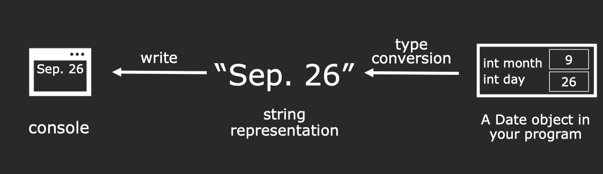

[Webpage of this course](https://web.stanford.edu/class/archive/cs/cs106l/cs106l.1184/lectures.html)

### Lec1

###### How to print a Date object to the console
* first convert the object to a string.
* write the string to the console.



###### How to read a double from a file
* First: we need to retrieve/send data from the source in string form.
* Second: we need to convert between data in our program and its string representation.


###### Streams - Introduction

A stream is an abstraction for input/output.

any primitive type can be inserted into a stream。


###### Reading Data From a File

---

To read a whole line, use
`getline(istream& stream, string& line);`


---

### Lec2

###### Output streams
* All output streams are of type `std::ostream`

###### Some additional methods for using streams

```C++
input.get(ch); // reads one char at a time
input.close(); // closes stream
input.clear(); // resets any fail bits
input.open("filename"); // open stream on file
input.seekg(0); // rewinds stream to start
```

###### Buffering
Writing to a console/file is a slow operation,If the program had to write each character immediately, runtime would significantly slow down. So we can solve this below:

* Accumulate characters in a temporary buffer/array.
* When buffer is full, write out all contents of the buffer to the output device at once.
(This process is known as flushing the stream)

`stream << std::endl;`等价于`stream << "\n" << std::flush;`

###### Stream bits
* Good bit
* EOF `End-of-file was reached during a previous operation`
* Fail `Logical error on a previous operation`
* Bad `Likely unrecoverable error on previous operation`

###### Chaining `>>` or `<<`

The `<<` and `>>` operators return the stream passed as their left argument.

###### Streams can be converted to bool

```C++

while(true) {
  stream >> temp;
  if(!stream) break; 
  do_something(temp);
}

==

while(stream >> temp) 
{ do_something(temp); }
```

###### Stream Manipulator


###### stringstream
Sometimes we want to be able to treat a string like a stream.


```C++
string IntegerToString(int myInt) {
    /*
     * We'll specifically use an ostringstream, which is just a
     * stringstream that you can only put things into.
     */
    std::ostringstream converter;
    /*
     * Putting the int into the ostringstream will convert
     * it into a string format.
     */
    converter << myInt;

    /* Ask for the string inside the ostringstream. */
    return converter.str();
}
```

```C++

int StringToInteger(const string& str) {
    /*
     * We'll specifically use an istringstream, which is just a
     * stringstream that you can only get things from.
     *
     * You can set its internal string when creating it or by doing
     * converter.str("string_to_set");
     */
    std::istringstream converter(str);
    /*
     * Try getting an int from the stream. If this is not succesful
     * then user input was not a valid input.
     */
    int value;
    if(converter >> value) {
        /*
         * See if we can extract a char from the stream.
         * If so, the user had junk after a valid int in their input.
         */
        char rem;
        if(converter >> rem) {
            /*
             * Throwing an error is a way of propogating up the funcion
             * callstack that something went wrong. Previous functions can
             * anticipate such an error and catch it. In this case, we will
             * just let the thrown domain_error propogate up until it terminates
             * the program.
             *
             * A domain_error is defined in the standard namespace as an error
             * to signal that the input arguments to the function were not valid.
             */
            throw std::domain_error(string("Unexpected character in input: ") + rem);
        }
        return value;
    }
    /* throw a domain error with a helpful error message. */
    throw std::domain_error(string("Failed to convert input: ") + str);
}
```