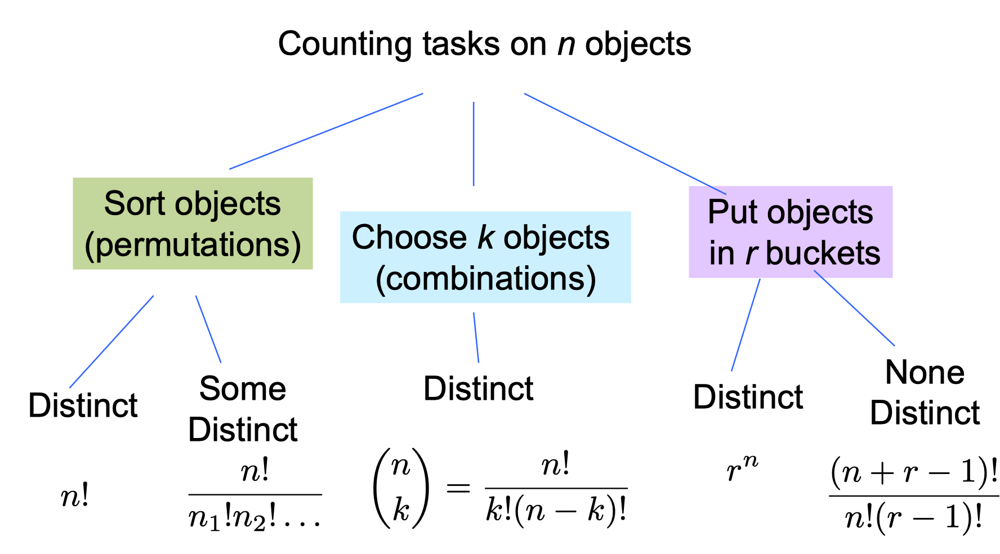

https://web.stanford.edu/class/archive/cs/cs109/cs109.1198/

### Lec1

###### Two Great Ideas
* Probability from Examples
* Artificial Neurons

###### Machine Learning
Basically just a rebranding of statistics and probability.

### Lec2 Combinatorics

###### Permutations
A permutation is an ordered arrangement of distinct object. n objects can be permuted in:
$n \times(n-1) \times(n-2) \times \cdots \times 2 \times 1=n !$

###### Sample Space
Sample space, S, is set of all possible outcomes of an experiment

###### Events
Event, E, is some subset of S.
