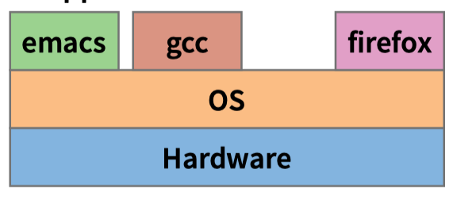
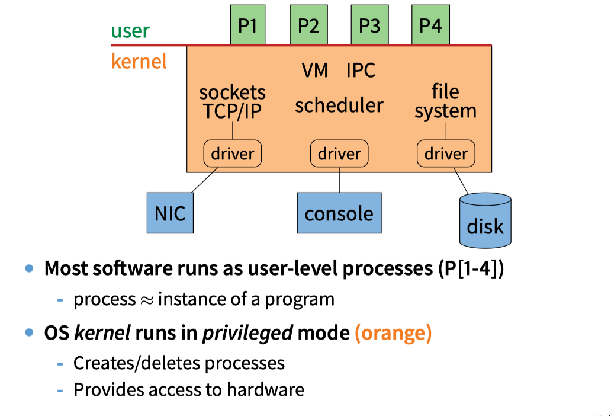
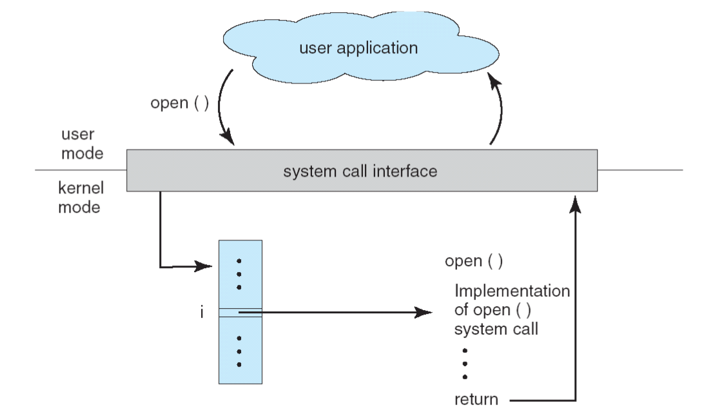
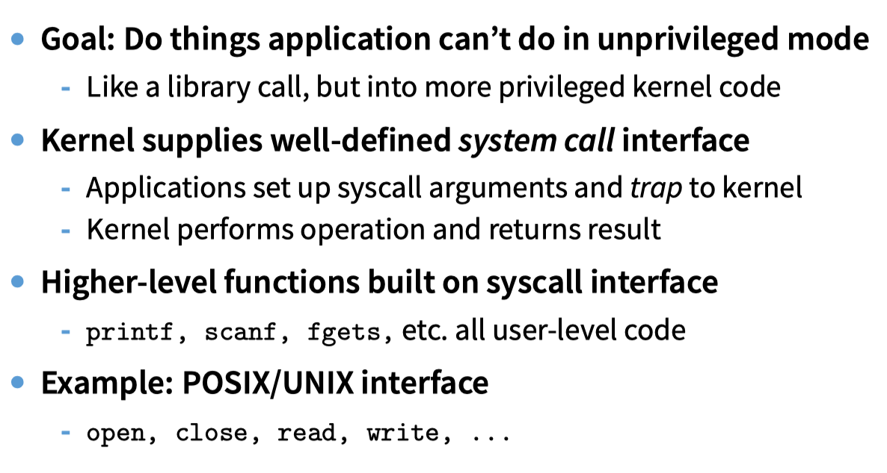

### Lec1

###### Layer between applications and hardware


###### Typical OS structure


###### System calls



### Lec2
###### Process
A **process** is an instance of a program running

###### Why processes?
---
* Simplicity of programming
* Speed: Higher throughput, lower latency

---

###### Inter-Process Communication
* By passing messages through the kernel
* By sharing a region of physical memory
* Through asynchronous signals or alerts

###### Creating processes

```C++
int fork (void);

Create new process that is exact copy of current one
Returns process ID of new process in “parent”
Returns 0 in “child”

```

```C++
int waitpid (int pid, int *stat, int opt);

- pid – process to wait for, or -1 for any

- stat – will contain exit value, or signal

- opt – usually 0 or WNOHANG

- Returns process ID or -1 on error

```

```C++
void exit (int status);

- Current process ceases to exist

- status shows up in waitpid (shied)

- By convention, status of 0 is success, non-zero error

```

```C++
int kill (int pid, int sig);

- Sends signal sig to process pid

- SIGTERM most common value, kills process by default (but application can catch it for “cleanup”)

- SIGKILL stronger, kills process always

```

```C++
int execve (char *prog, char **argv, char **envp);

- prog – full pathname of program to run

- argv – argument vector that gets passed to main

- envp – environment variables, e.g., PATH, HOME
```


