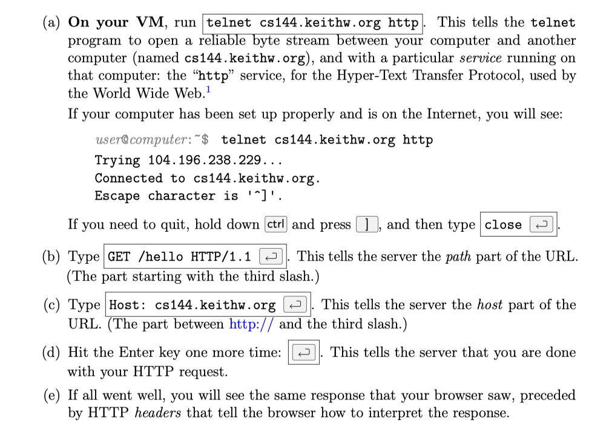
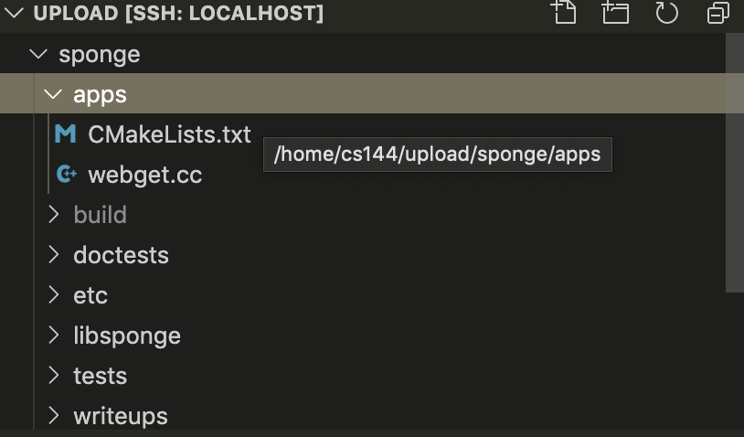
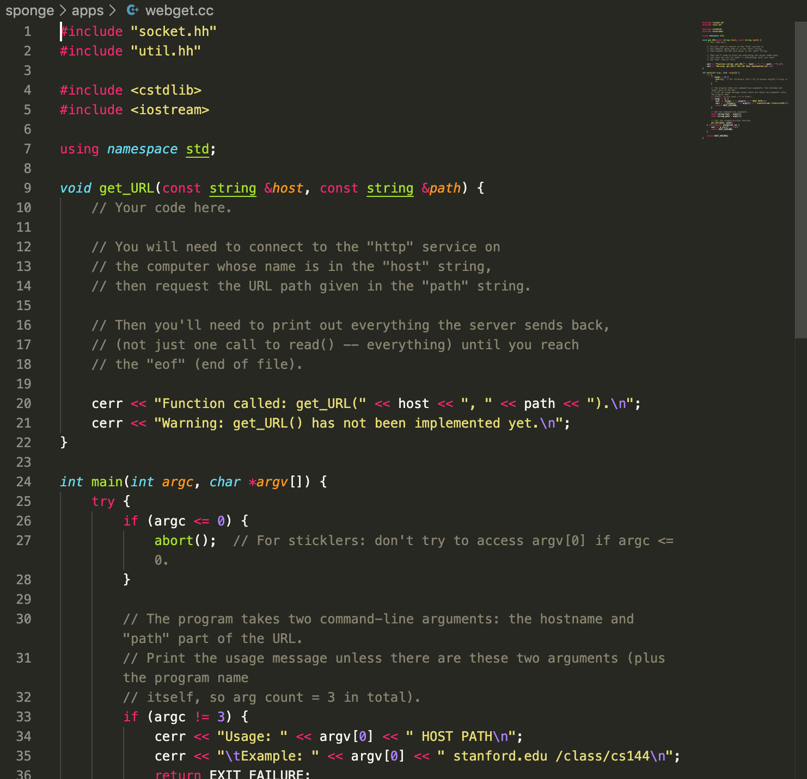
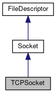
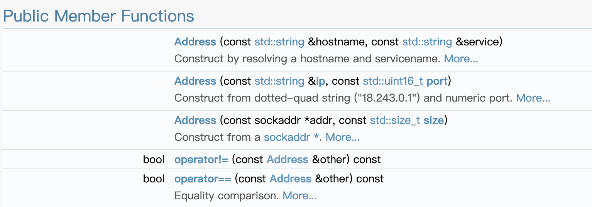
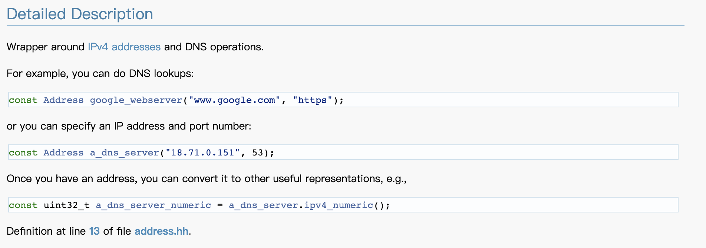

### 1.Overview
Writing a network program using an OS stream socket to get the following results.

That's to say we’ll write a program to create a TCP stream socket, connects to a Web server, and fetches a page.

**About the environment: Strongly recommend the VM setup shown on the webpage.**

### 2.Set-Up
|No.|command|Result|
|-|-|-|
|1|`git clone https://github.com/cs144/sponge`|fetch the source code for the whole lab|
|2|`cd sponge`|Enter the Lab 0 directory|
|3|`mkdir build`|Create a directory to compile the lab software|
|4|`cd build`|Enter the build directory|
|5|`cmake ..`|Set up the build system|
|6|`make`|Compile the source code|

**NOTES: 5-6 are both done under the build directory.**

### 3.Writing webget

###### 3.1 open the file `../apps/webget.cc` in IDE(I use vscode)

###### 3.2 Some hints given by the writeup
|||
|-|-|
|1|In HTTP, each line must be ended with “\r\n”|
|2|We must tell the server when we have finished writing our request to the socket,otherwise, the server will keep waiting for your request.|
|3|Make sure to read and print all the output from the server until the socket reaches “EOF” (end of file)—a single call to read is not enough.|
|4|Ten lines of code|

###### 3.3 Introduction to TCPSocket

[TCPSocket](http://man7.org/linux/man-pages/man7/tcp.7.html)
To create an outgoing TCP connection use **connect(2)** to establish a connection to another TCP socket.

To receive new incoming connections, first **bind(2)** the socket to a local address and port and then call **listen(2)** to put the socket into the listening state.  After that a new socket for each incoming connection can be accepted using **accept(2)**

That's to say we need only connect in this lab.

###### 3.4 Introduction to Address

[address](https://cs144.github.io/doc/lab0/class_address.html)

|Function|Definition|
|-|-|
|connect()|`void Socket::connect	(	const Address & 	address	)`|
