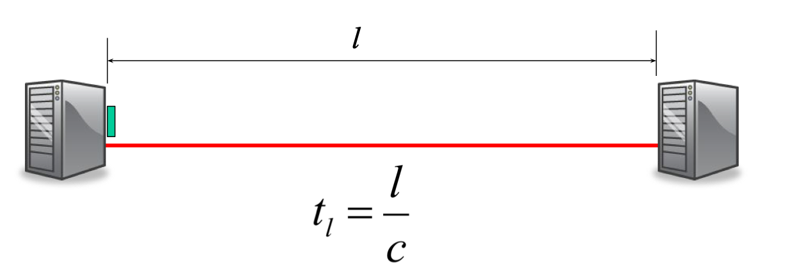
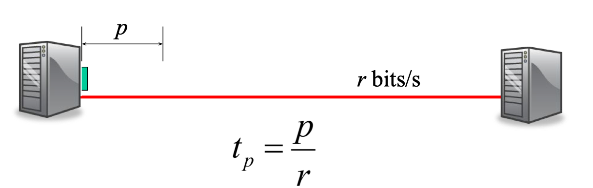
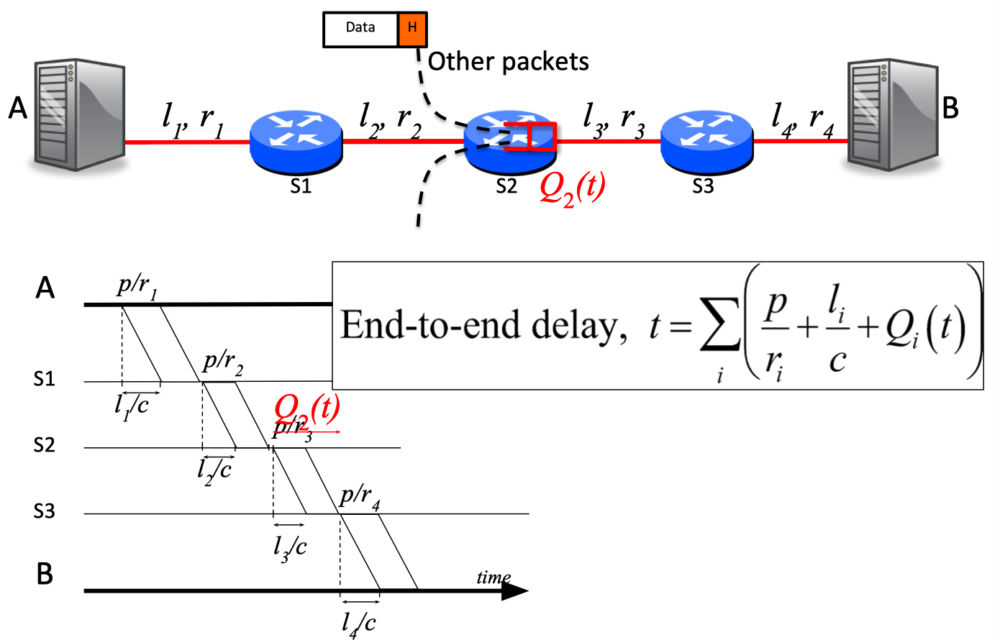

https://cs144.github.io/

### 1.How the Internet Works

* Packets may be damaged
* Packets may arrive out of order
* Packets may be duplicated
* They may not arrive at all!

###### traceroute

###### TCP’s job
* Makes sure all data is delivered correctly.
* Delivers data to the application in the right order

### Lec3 Packet Switching

###### Why does the Internet use Packet Switching?
---
* Packet switching allows many, bursty flows to share the same link efficiently.
* Resilience to failure of links & routers

---
###### Useful definitions
* Propagation Delay:The time it takes a single bit to travel over a link at propagation speed c.

* Packetization Delay:The time from when the first to the last bit of a packet is transmitted.

* End-to-end delay

