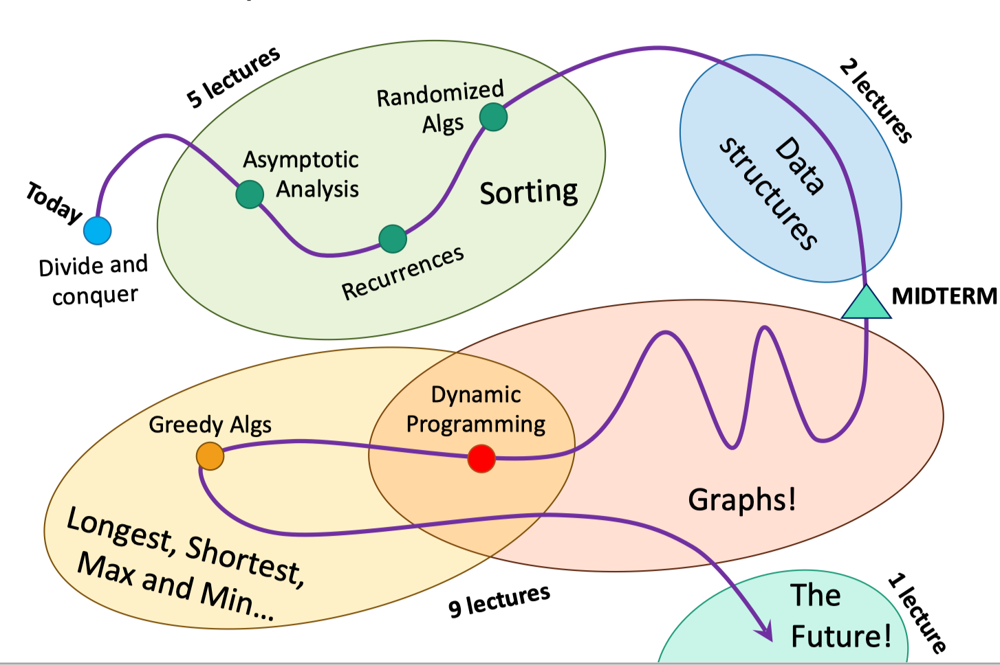
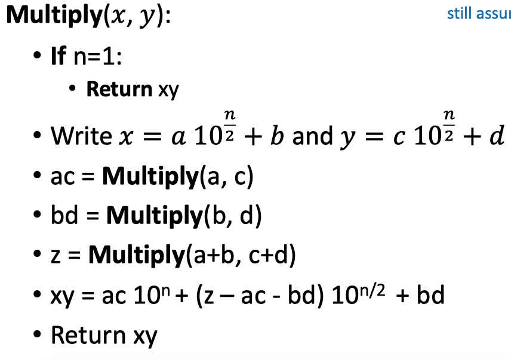
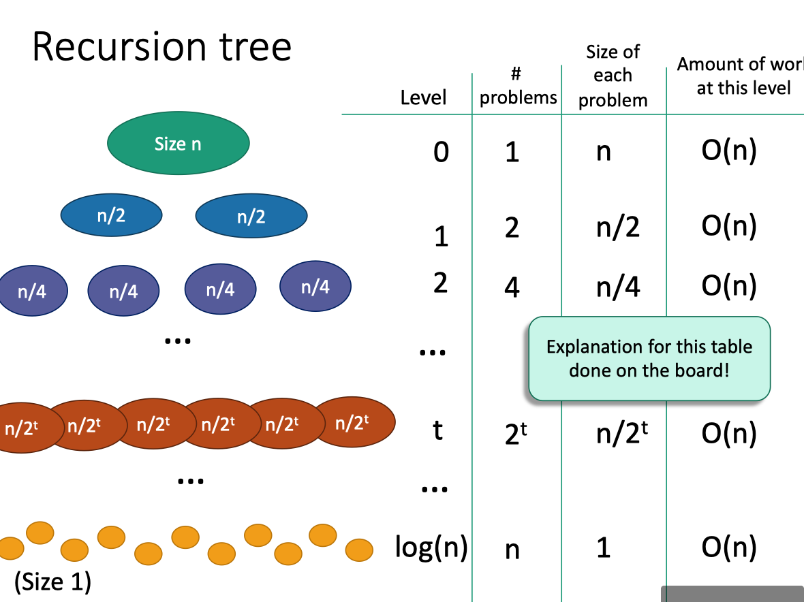
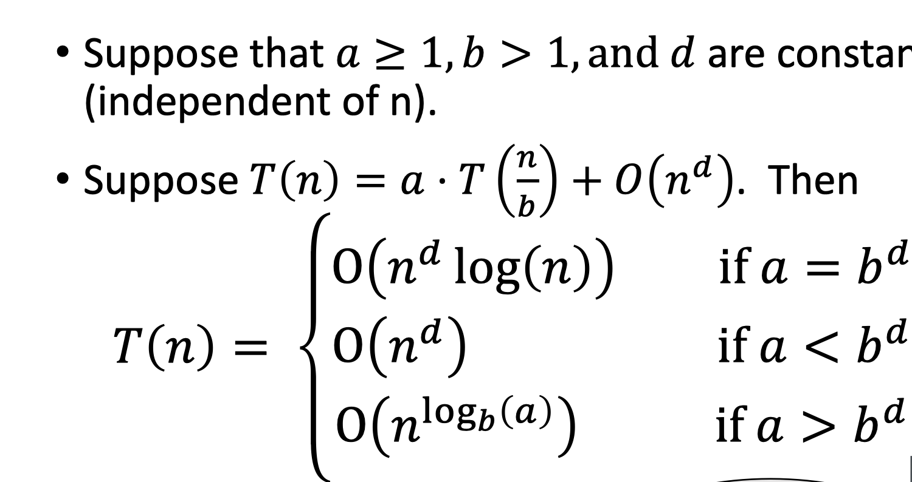
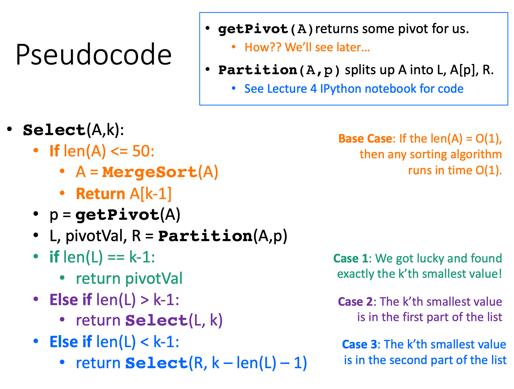
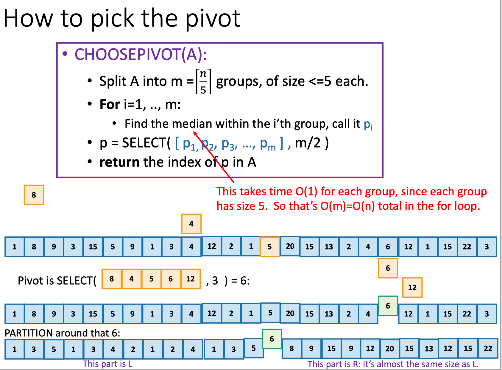
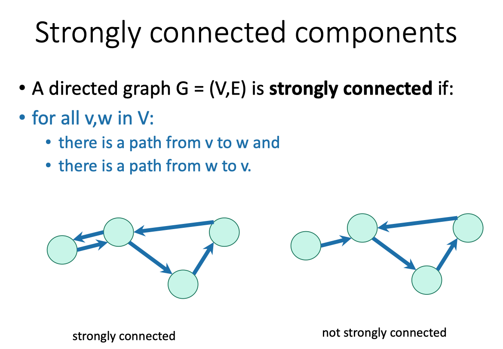
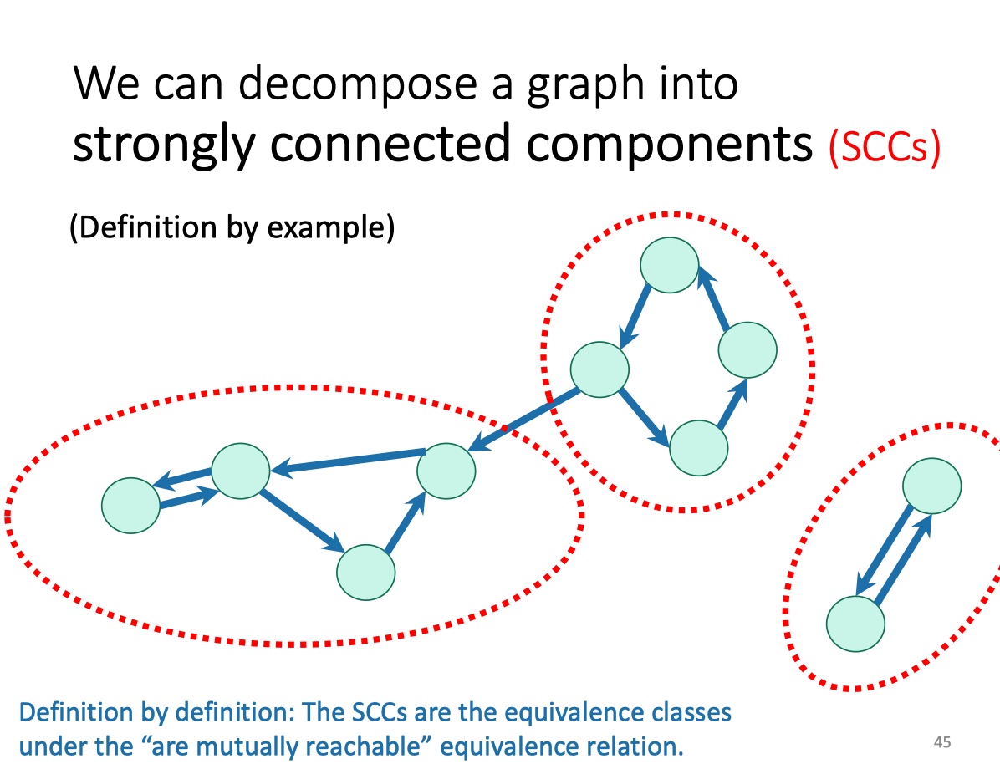
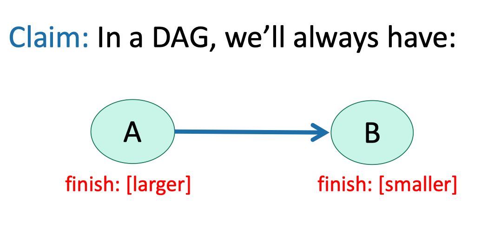

http://web.stanford.edu/class/cs161/schedule.html

### Lec1

###### Roadmap

###### Karatsuba Integer Multiplication

### Lec2
* `O()`
$$
\begin{aligned} T(n) &=O(g(n)) \\ & \Leftrightarrow \\ \exists c, n_{0}>0 & \text { s.t. } \forall n \geq n_{0} \\ T(n) & \leq c \cdot g(n) \end{aligned}
$$

* $\Omega$
$$
\begin{array}{c}T(n)=\Omega(g(n)) \\ \Leftrightarrow \\ \exists c, n_{0}>0 \text { s.t. } \forall n \geq n_{0} \\ c \cdot g(n) \leq T(n)\end{array}
$$

* $\Theta$ means the both above

###### Merge Sort

### Lec4

###### Select-k problem

###### How to pick the pivot

### Lec5 Randomized algorithms and QuickSort

###### Randomized algorithms

### Lec7

### Lec 10
###### Strongly connected components

