### 02 - The Unix File System, First Glimpse at Git

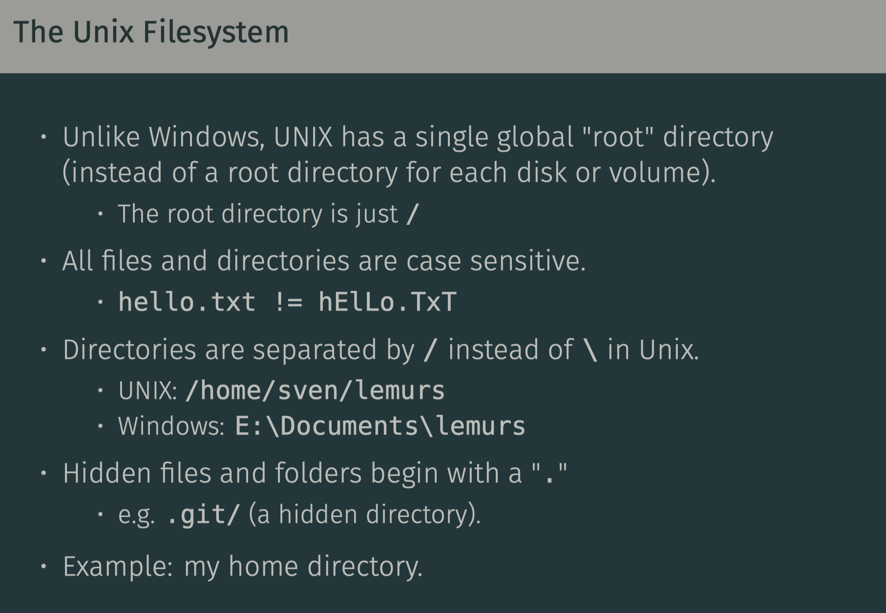

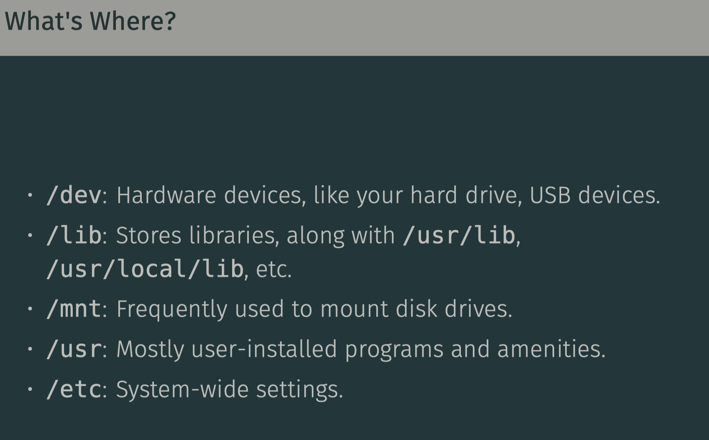

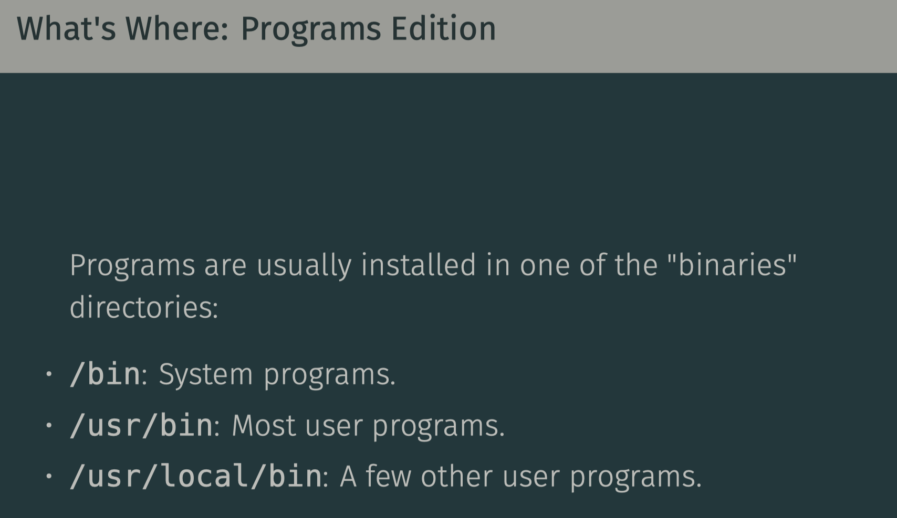

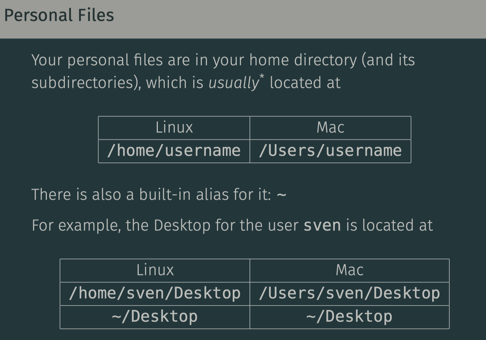

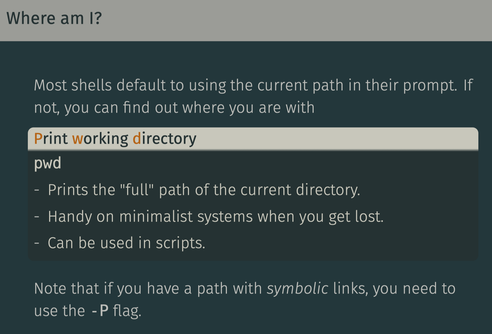

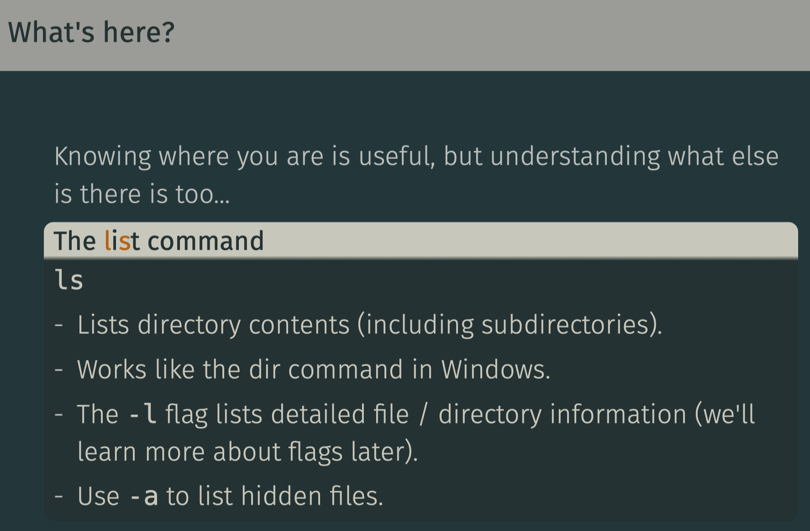

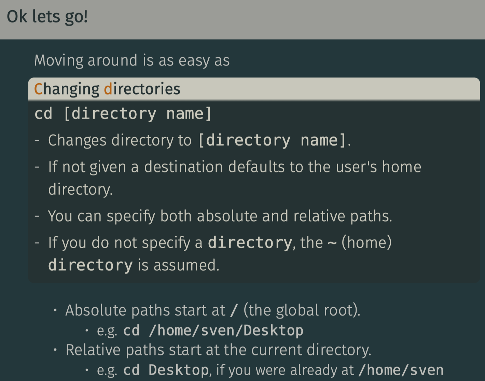

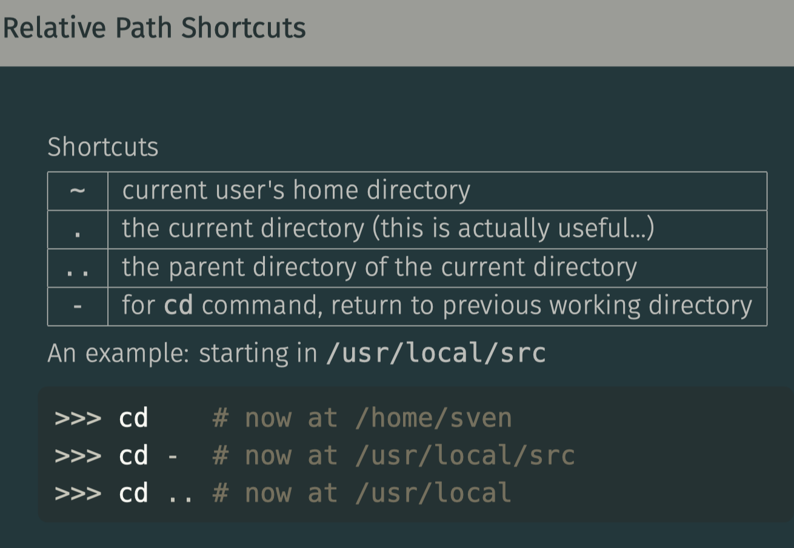

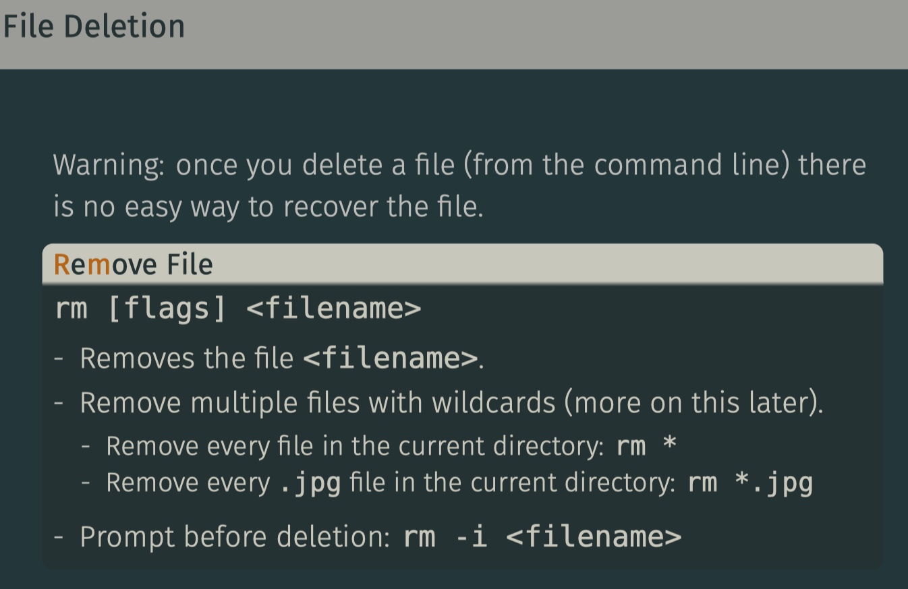

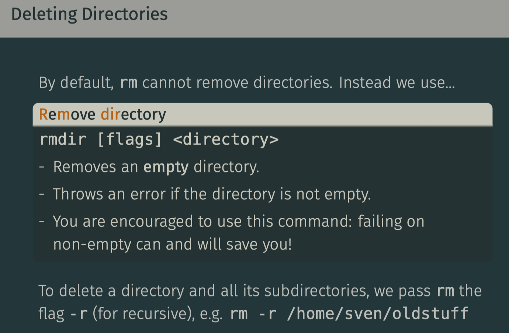

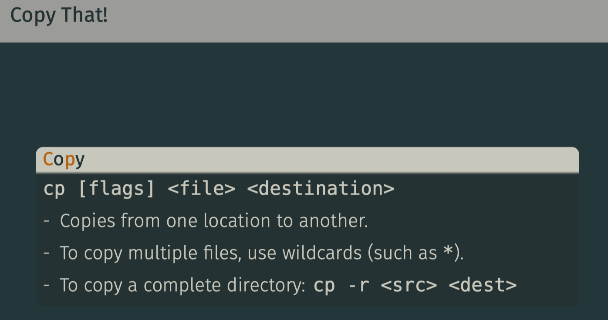

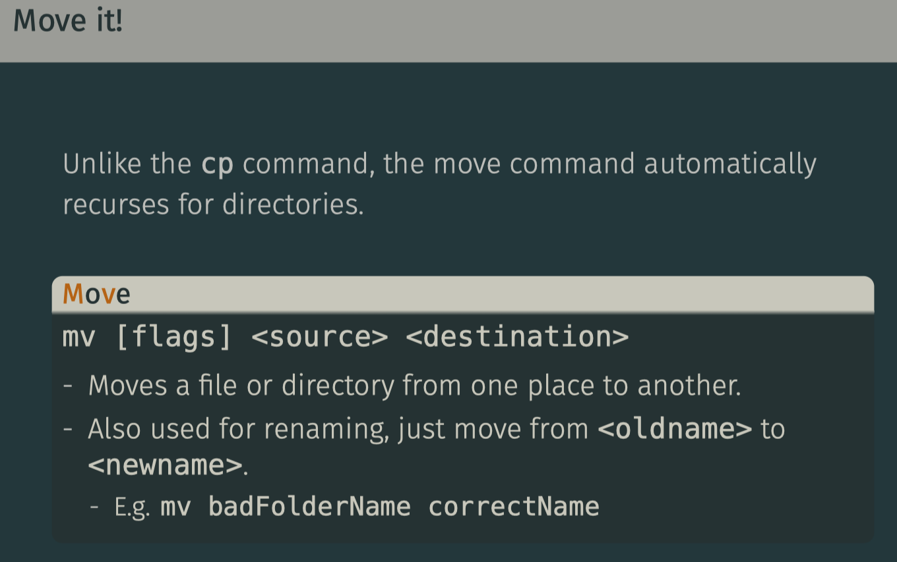

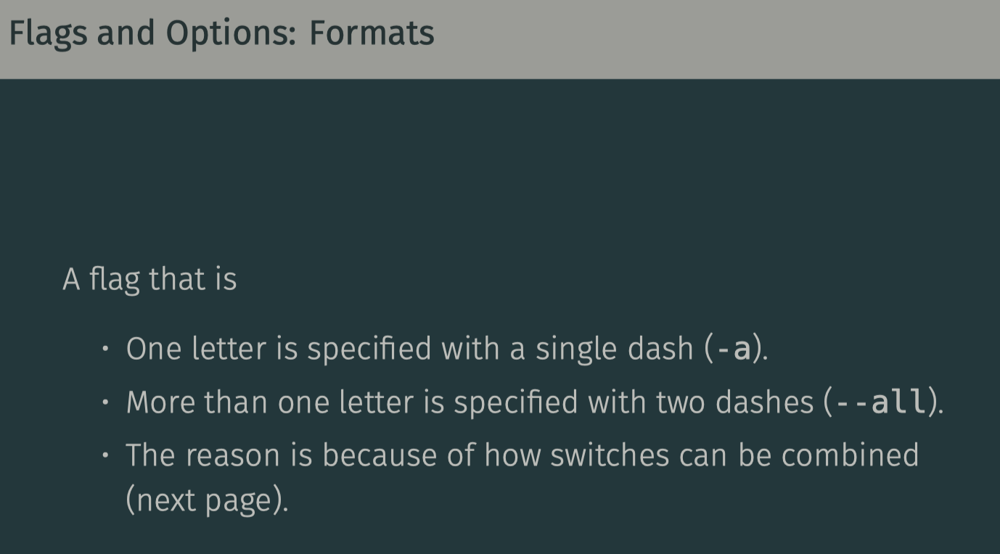

### 03 - Manipulating Files and Using Git

User and Groups
----

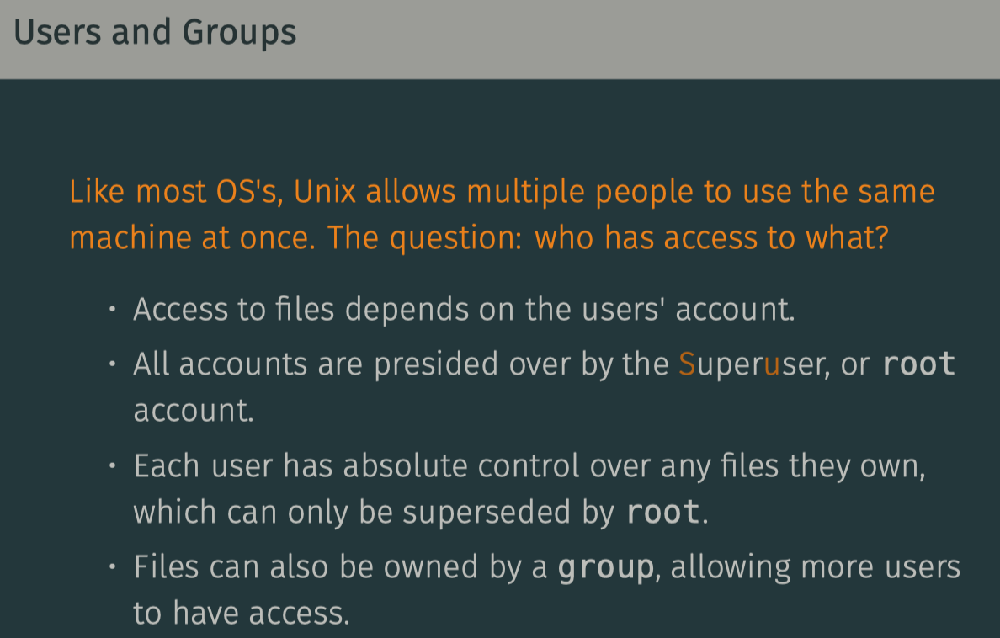

File Ownership
---
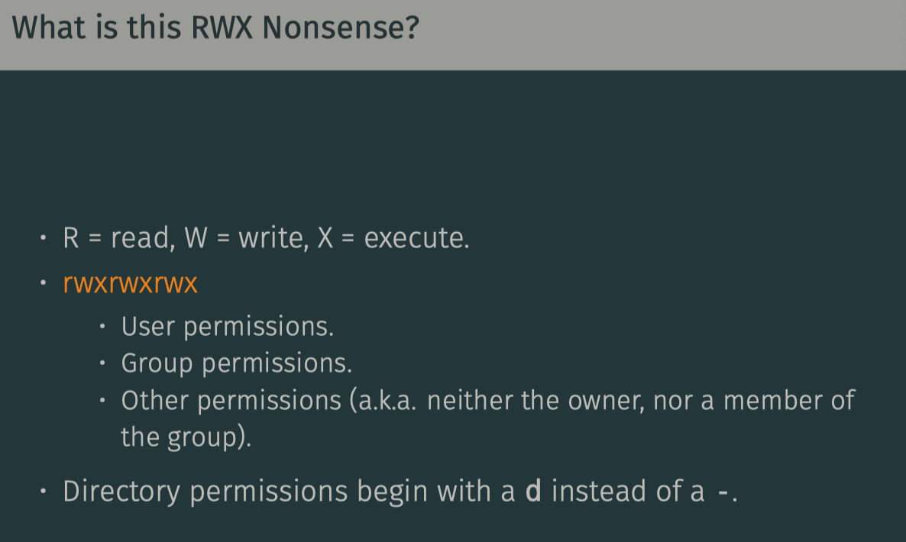

Changing Permissions
---
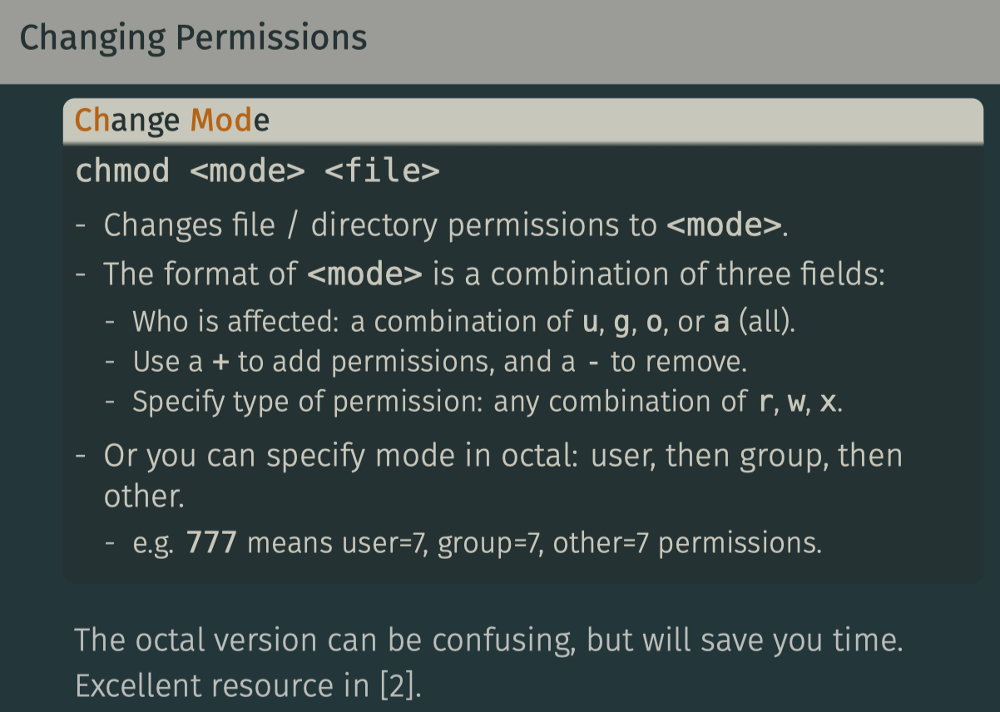

Changing Ownership
---

