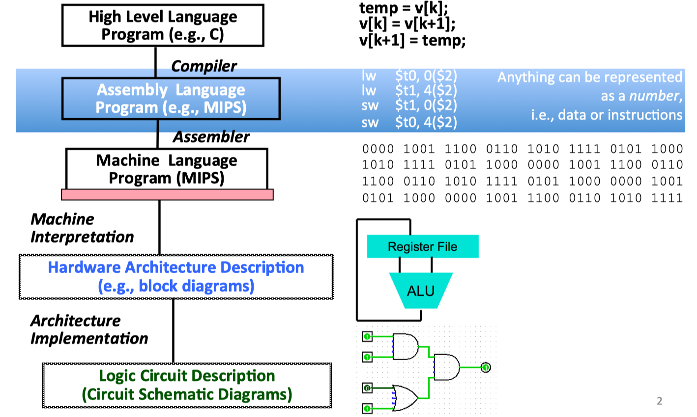
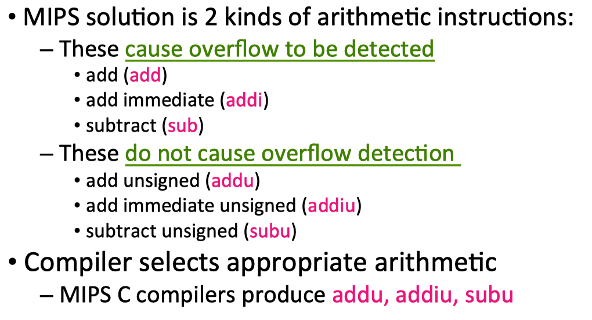
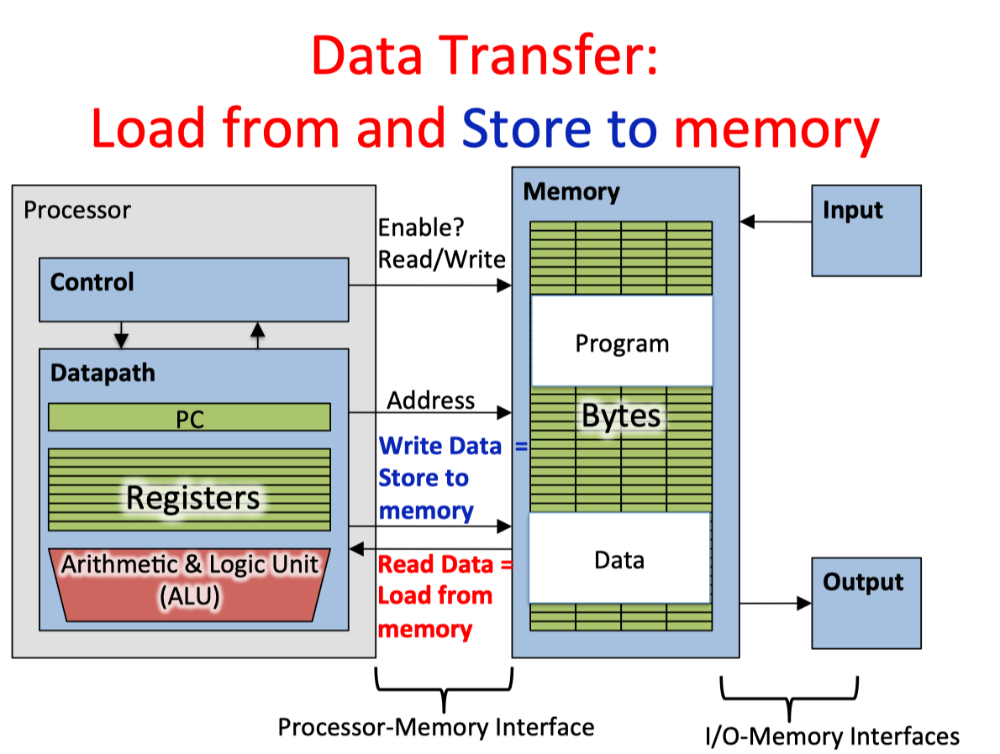
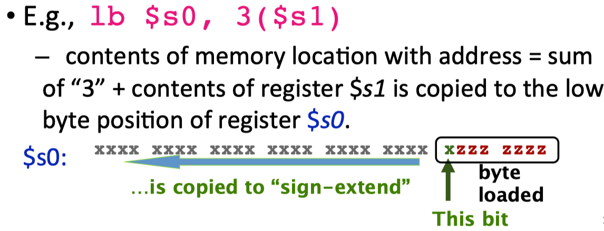
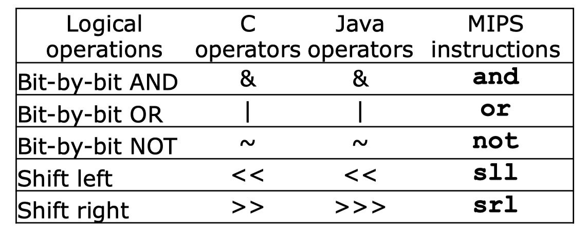
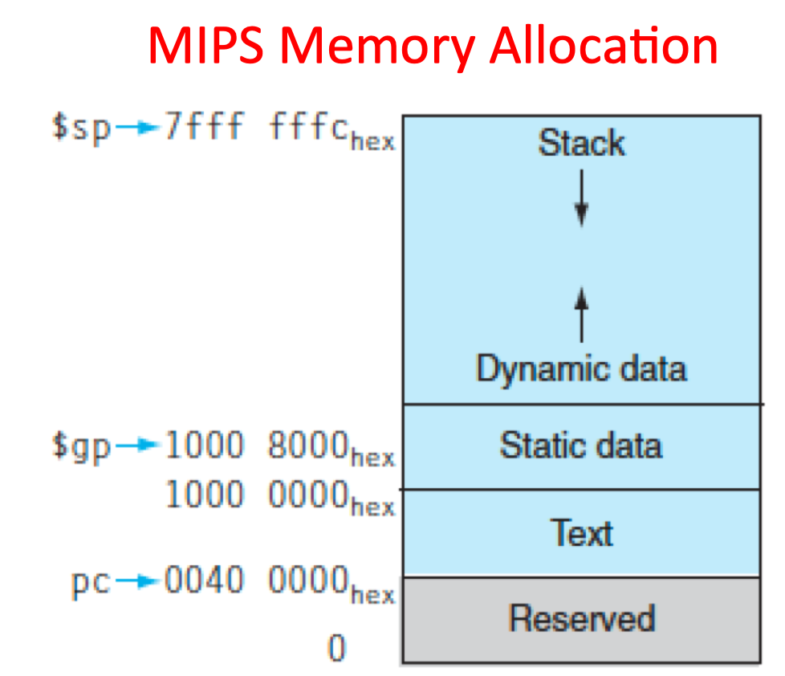
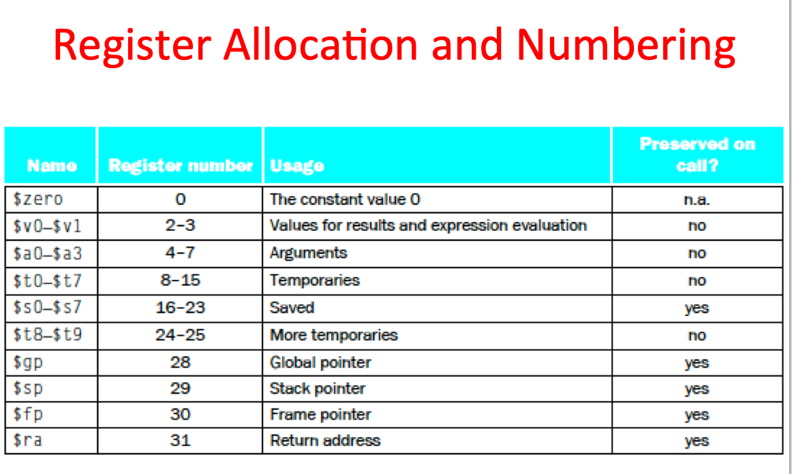

WebPage of this Course：http://www-inst.eecs.berkeley.edu/~cs61c/su15/

The notes are mostly from PPt
of this course.
### Lec1

###### 6 Great Ideas in Computer Architecture
* 1. Abstraceon (Layers of Representaeon/Interpretaeon)
* 2. Moore’s Law (Designing through trends)
* 3. Principle of Locality (Memory Hierarchy)
* 4. Parallelism
* 5. Performance Measurement & Improvement
* 6. Dependability via Redundancy


### Lec2

###### Components of a Computer


###### Difference between Compiler and Assembler


###### C Pre-­‐Processor (CPP)

* C source files first pass through macro processor, CPP, before compiler sees code
* CPP replaces comments with a single space
* CPP commands begin with `“#”`
* `#include “file.h” /* Inserts file.h into output */`
* `#include <stdio.h> /* Looks for file in standard locaWon */`
* `#define M_PI (3.14159) /* Define constant */`
* `#if/#endif /* CondiWonal inclusion of text */`
* Use –save-­‐temps opWon to gcc to see result of preprocessing


###### Why use pointers?
* If we want to pass a large struct or array, it’s easier / faster / etc. to pass a pointer than the whole thing
* In general, pointers allow cleaner, more compact code


**I hand you a thousand \$1 bills and ten envelopes. Your job is to find a way to put various numbers of dollar bills in those ten envelopes so that no matter what amount of money I ask you for (between $1-1000), you can simply hand me some combination of envelopes and always be assured of giving me the correct amount of cash.**

Consider the binary notation～


###### Some basic git

https://learngitbranching.js.org/?locale=zh_CN

`Git` 的分支也非常轻量。它们只是简单地指向某个提交纪录,仅此而已。
创建分支：
`git branch newImage`

`git checkout <name>`切换分支

对了，有个更简洁的方式：如果你想创建一个新的分支同时切换到新创建的分支的话，可以通过 `git checkout -b <your-branch-name>` 来实现

第二种合并分支的方法是 `git rebase`。Rebase 实际上就是取出一系列的提交记录，“复制”它们，然后在另外一个地方逐个的放下去。
`Rebase` 的优势就是可以创造更线性的提交历史，这听上去有些难以理解。如果只允许使用 `Rebase` 的话，代码库的提交历史将会变得异常清晰。


### Lec5 Intro to Assembly Language, MIPS Intro

###### Levels of Representation/ Interpretation



The set of instrucHons a parHcular CPU implements is an **Instruction Set Architecture (ISA)**.

###### MIPS VS. Intel x86
* MIPS is simple, elegant.
* MIPS widely used in embedded apps, x86 liBle used in embedded, and more embedded computers than PCs

###### registers
Assembly Operands are registers

In Assembly Language, registers have no type; operation determines how register contents are treated

**Overflow** occurs when there is a “mistake” in arithmetic due to the limited precision in computers.




###### Data Transfer: Load from and Store to memory



`Load Word (lw) in MIPS`
`Store Word (sw) in MIPS`
`load byte: lb`
`store byte: sb`




###### MIPS Logical InstrucHons



###### Computer Decision Making

MIPS: if-­‐statement instrucHon is `beq register1,register2,L1`means: go to statement labeled L1 if `(value in register1) == (value in register2)`


`slt reg1,reg2,reg3`

```C++
if (reg2 < reg3) 
    reg1 = 1; 
else reg1 = 0;
```

### Lecture 6: More MIPS, MIPS Func.ons

###### Six Fundamental Steps in Calling a FuncGon
* Put parameters in a place where funcGon can access them
* Transfer control to funcGon
* Acquire (local) storage resources needed for funcGon
* Perform desired task of the funcGon
* Put result value in a place where calling code can access it and restore any registers you used
* Return control to point of origin, since a funcGon can be called from several points in a program


---
`$a0–$a3`: four argument registers to pass parameters
`$v0–$v1`: two value registers to return values
`$ra`: one return address register to return to the point of origin

---

In MIPS, all instructions are 4 bytes, and stored in memory just like data. 
Single instruction to jump and save return address:jump and link (`jal`)
“link” means form an address or link that points to calling site to allow funcGon to return to proper address
Jumps to address and simultaneously saves the address of the following instrucGon in register `$ra`




