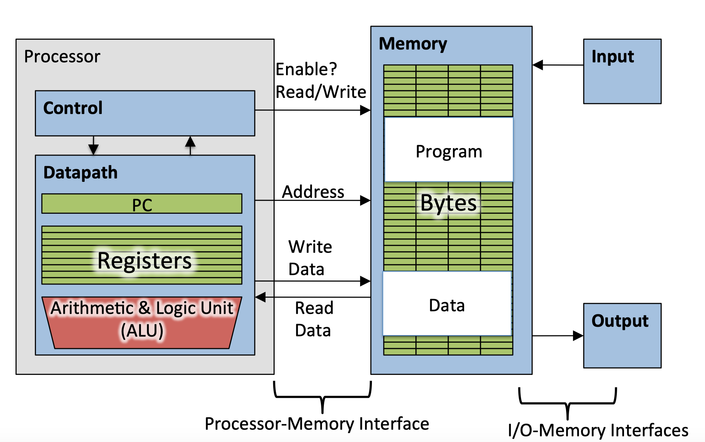

WebPage of this Course：http://www-inst.eecs.berkeley.edu/~cs61c/su15/

The notes are mostly from PPt
of this course.
### Lec1

###### 6 Great Ideas in Computer Architecture
* 1. Abstraceon (Layers of Representaeon/Interpretaeon)
* 2. Moore’s Law (Designing through trends)
* 3. Principle of Locality (Memory Hierarchy)
* 4. Parallelism
* 5. Performance Measurement & Improvement
* 6. Dependability via Redundancy

### Lec2

###### Components of a Computer

###### Difference between Compiler and Assembler

###### C Pre-­‐Processor (CPP)

* C source files first pass through macro processor, CPP, before compiler sees code
* CPP replaces comments with a single space
* CPP commands begin with `“#”`
* `#include “file.h” /* Inserts file.h into output */`
* `#include <stdio.h> /* Looks for file in standard locaWon */`
* `#define M_PI (3.14159) /* Define constant */`
* `#if/#endif /* CondiWonal inclusion of text */`
* Use –save-­‐temps opWon to gcc to see result of preprocessing

###### Why use pointers?
* If we want to pass a large struct or array, it’s easier / faster / etc. to pass a pointer than the whole thing
* In general, pointers allow cleaner, more compact code

