WebPage of this Course：http://www-inst.eecs.berkeley.edu/~cs61c/su15/

The notes are mostly from PPt
of this course.
### Lec1

###### 6 Great Ideas in Computer Architecture
* 1. Abstraceon (Layers of Representaeon/Interpretaeon)
* 2. Moore’s Law (Designing through trends)
* 3. Principle of Locality (Memory Hierarchy)
* 4. Parallelism
* 5. Performance Measurement & Improvement
* 6. Dependability via Redundancy


### Lec2

###### Components of a Computer


###### Difference between Compiler and Assembler


###### C Pre-­‐Processor (CPP)

* C source files first pass through macro processor, CPP, before compiler sees code
* CPP replaces comments with a single space
* CPP commands begin with `“#”`
* `#include “file.h” /* Inserts file.h into output */`
* `#include <stdio.h> /* Looks for file in standard locaWon */`
* `#define M_PI (3.14159) /* Define constant */`
* `#if/#endif /* CondiWonal inclusion of text */`
* Use –save-­‐temps opWon to gcc to see result of preprocessing


###### Why use pointers?
* If we want to pass a large struct or array, it’s easier / faster / etc. to pass a pointer than the whole thing
* In general, pointers allow cleaner, more compact code


**I hand you a thousand \$1 bills and ten envelopes. Your job is to find a way to put various numbers of dollar bills in those ten envelopes so that no matter what amount of money I ask you for (between $1-1000), you can simply hand me some combination of envelopes and always be assured of giving me the correct amount of cash.**

Consider the binary notation～


###### Some basic git

https://learngitbranching.js.org/?locale=zh_CN

`Git` 的分支也非常轻量。它们只是简单地指向某个提交纪录,仅此而已。
创建分支：
`git branch newImage`

`git checkout <name>`切换分支

对了，有个更简洁的方式：如果你想创建一个新的分支同时切换到新创建的分支的话，可以通过 `git checkout -b <your-branch-name>` 来实现

第二种合并分支的方法是 `git rebase`。Rebase 实际上就是取出一系列的提交记录，“复制”它们，然后在另外一个地方逐个的放下去。
`Rebase` 的优势就是可以创造更线性的提交历史，这听上去有些难以理解。如果只允许使用 `Rebase` 的话，代码库的提交历史将会变得异常清晰。


### Lec5 Intro to Assembly Language, MIPS Intro

###### Levels of Representation/ Interpretation


The set of instrucHons a parHcular CPU implements is an **Instruction Set Architecture (ISA)**.

###### MIPS VS. Intel x86
* MIPS is simple, elegant.
* MIPS widely used in embedded apps, x86 liBle used in embedded, and more embedded computers than PCs

###### registers
Assembly Operands are registers

In Assembly Language, registers have no type; operation determines how register contents are treated

**Overflow** occurs when there is a “mistake” in arithmetic due to the limited precision in computers.


###### Data Transfer: Load from and Store to memory


`Load Word (lw) in MIPS`
`Store Word (sw) in MIPS`
`load byte: lb`
`store byte: sb`


###### MIPS Logical InstrucHons


###### Computer Decision Making

MIPS: if-­‐statement instrucHon is `beq register1,register2,L1`means: go to statement labeled L1 if `(value in register1) == (value in register2)`


`slt reg1,reg2,reg3`

```C++
if (reg2 < reg3) 
    reg1 = 1; 
else reg1 = 0;
```

### Lecture 6: More MIPS, MIPS Func.ons

###### Six Fundamental Steps in Calling a FuncGon
* Put parameters in a place where funcGon can access them
* Transfer control to funcGon
* Acquire (local) storage resources needed for funcGon
* Perform desired task of the funcGon
* Put result value in a place where calling code can access it and restore any registers you used
* Return control to point of origin, since a funcGon can be called from several points in a program


---
`$a0–$a3`: four argument registers to pass parameters
`$v0–$v1`: two value registers to return values
`$ra`: one return address register to return to the point of origin

---

In MIPS, all instructions are 4 bytes, and stored in memory just like data. 
Single instruction to jump and save return address:jump and link (`jal`)
“link” means form an address or link that points to calling site to allow funcGon to return to proper address
Jumps to address and simultaneously saves the address of the following instrucGon in register `$ra`


### Lec7 MIPS Instruc,on Formats
* I-­‐format: used for instrucHons with immediates, lw and sw (since offset counts as an immediate), and branches (beq and bne)
* J-­‐format: used for j and jal
* R-­‐format: used for all other instrucHons

###### R-­‐Format InstrucHons
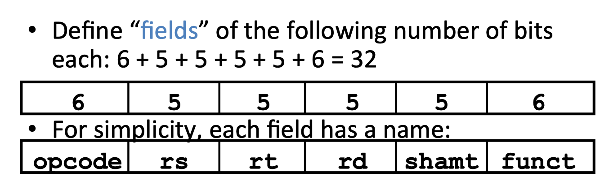

* opcode: parHally specifies what instrucHon it is.**Note: This number is equal to 0 for all R-­‐Format instrucHons.**
* funct: combined with opcode, this number exactly specifies the instrucHon
* rs (Source Register): usually used to specify register containing first operand
* rt (Target Register): usually used to specify register containing second operand (note that name is misleading)
* rd (DesHnaHon Register): usually used to specify register which will receive result of computaHon


###### I-­‐Format InstrucHons
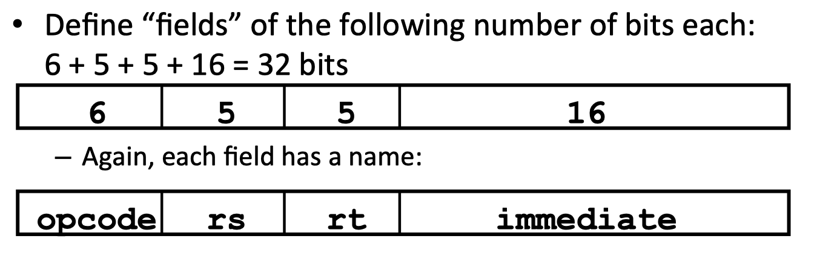

The Immediate Field:
* addi, slti, sltiu, the immediate is sign-­extended to 32 bits. Thus, it’s treated as a signed integer.


###### Dealing With Large Immediates

Load Upper Immediate (`lui`)

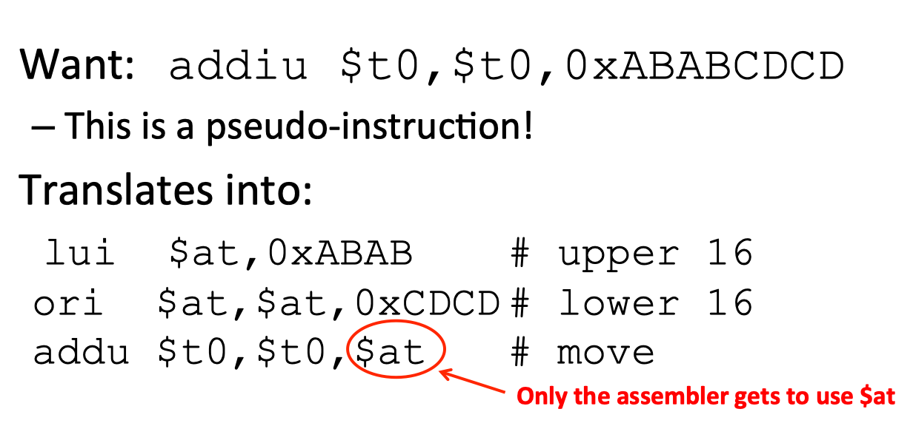


###### J-­‐Format InstrucHons
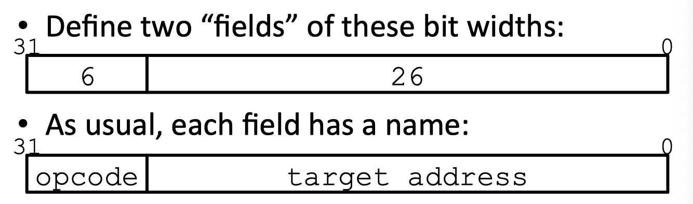

New PC = { (PC+4)[31..28], target address, 00 }


### Lec14 Caches, Part I

###### Locality
* Temporal Locality (locality in Jme)
If a memory locaJon is referenced, then it will tend to be referenced again soon

* Spatial Locality (locality in space)
If a memory locaJon is referenced, the locaJons with nearby addresses will tend to be referenced soon

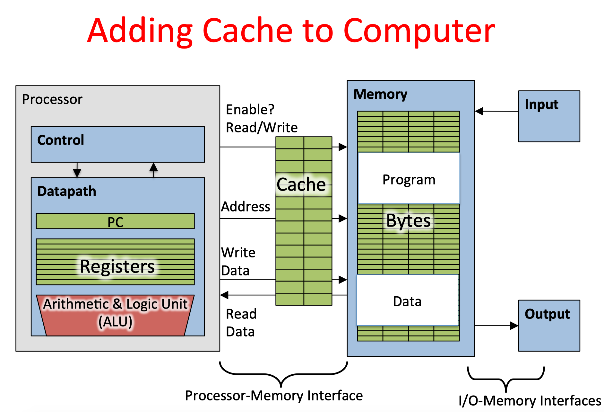


###### Memory Access with Cache
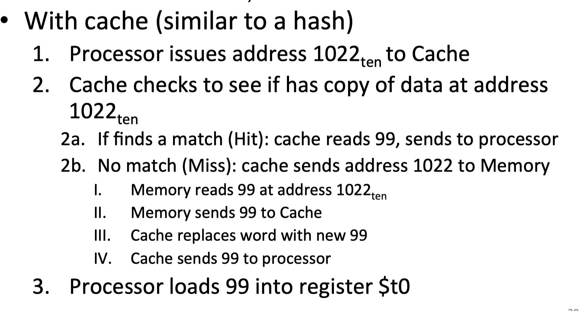

###### Direct-­‐Mapped Cache Example
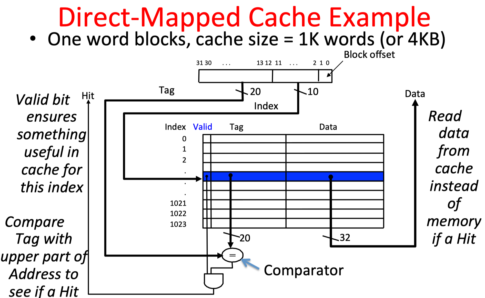

######  Multiword-­‐Block Direct-­‐Mapped Cache
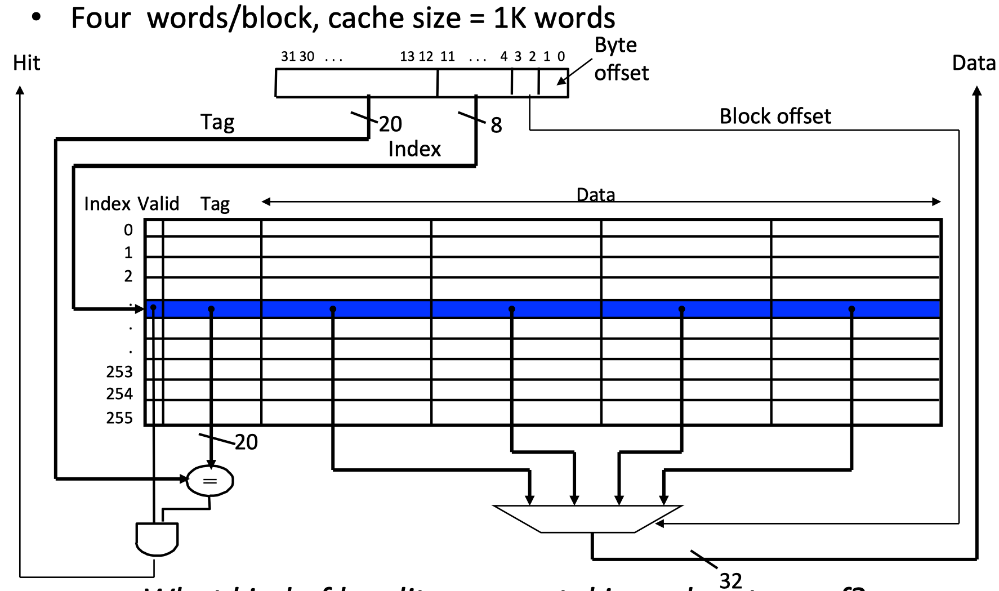


###### Handling Stores with Write-­‐Through

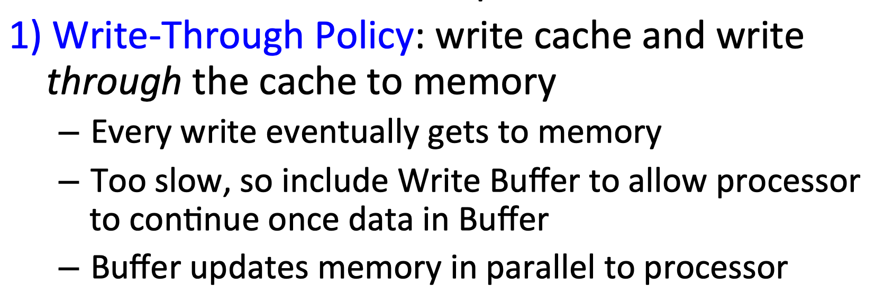
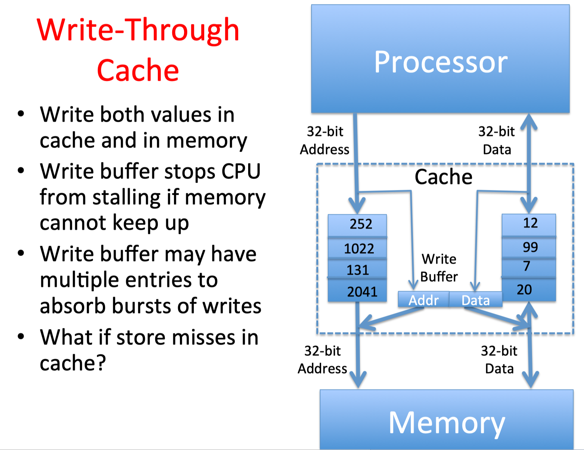
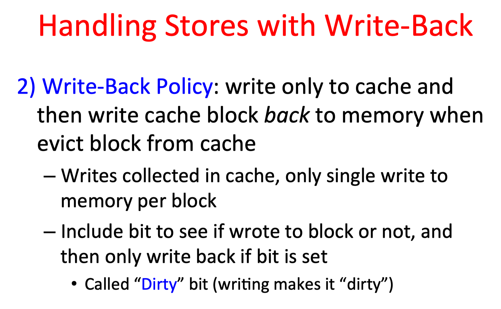
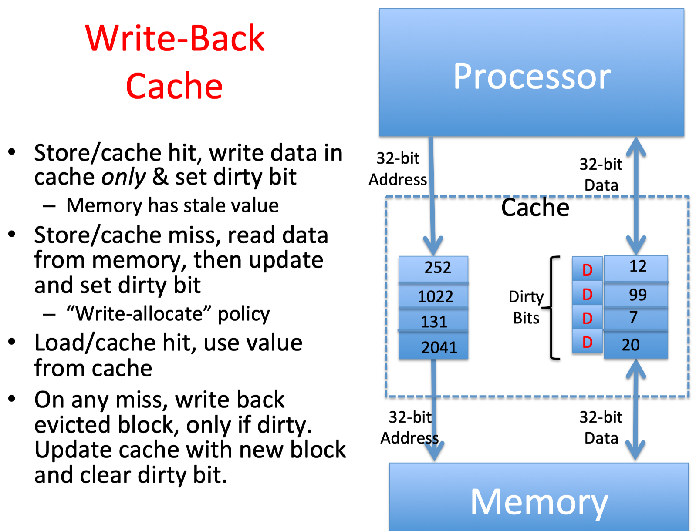

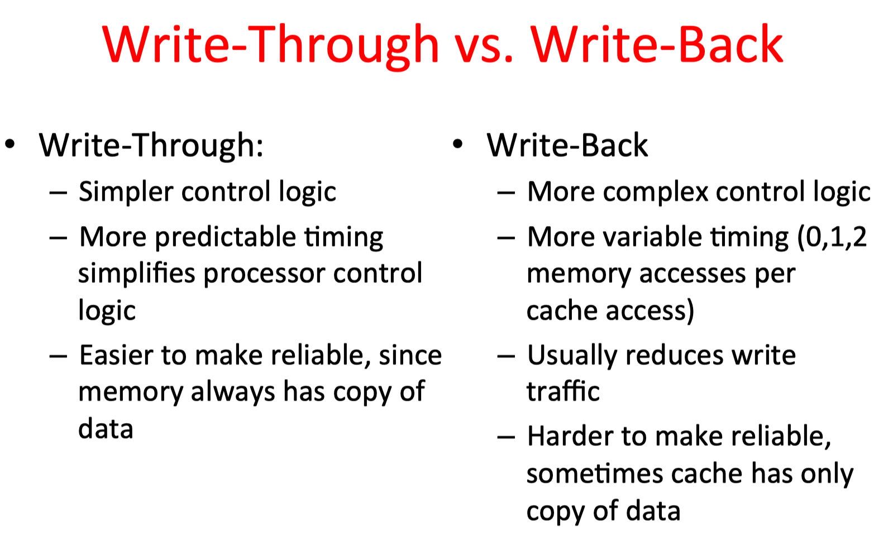


### HW1
BITMASKS
---
Often we will use what are known as 'bitmasks' (or just 'masks'), which are binary constants that we use to perform bitwise operations with to produce desired changes in the bits of numbers. 

For example, file permissions in UNIX consists of 9 bits - read, write, and execute for User, Group, and Other (from left to right: rwxrwxrwx). You can actually see this bits for all the files in a directory, by running the command "ls -l" in a terminal.


Let f be a variable holding the file permissions of a file of interest in its least significant 9 bits. We wish to leave the other bits of f unchanged.


Note: Because we have not specified the data type of f, you don't know how long the masks need to be. Constants are typically extended with zeros. Here the NOT operator can come in handy for generating leading 1's.


---
第一个是用户，第二个是本用户所在组，第三个是其它用户
rwx代表允许用户读，允许用户写，允许用户执行

---

* Fill in the blank in this C command to turn on the read permission for User and Other. Use a hexadecimal constant.

`f = f | 0X104 ;`
* Fill in the blank in this C command to change the execute permission for Group and Other. Use a binary constant.


In C, an array name is not a variable, but rather a pointer to the first element of the array. Putting an & in front of an expression gets the "address of" the expression. The "address of" the array x is where it begins, which is the location of the first element in the array x.


大小端
假设上述变量x类型为int，位于地址0x100处，它的值为0x01234567，地址范围为0x100~0x103字节，其内部排列顺序依赖于机器的类型。大端法从首位开始将是：0x100: 01, 0x101: 23,..。而小端法将是：0x100: 67, 0x101: 45,..。

区别就是地址刚开始的位置存的是最高位还是最低位。


