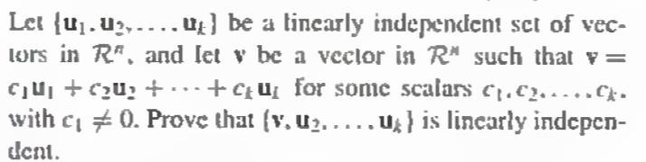
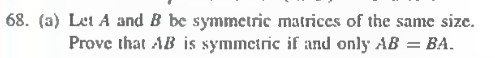
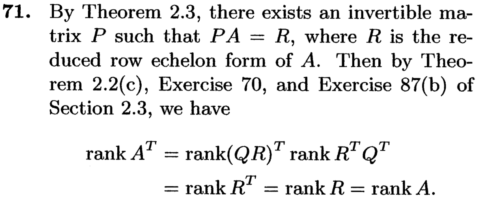

#### Chapter1
##### 1.3

###### 77.Let [A b] be the augmented matrix of a system of linear equations. Prove thant if its reduced row echelon form is [R c], then R is thc reduced row echelon form of A.

---
If [R c] is in reduced row echelon form, then so is R. If we apply the same row operations to A that were applied to [A b] to produce [R c], we obtain the matrix R. So R is the reduced row echelon form of A.

---

##### 1.4

###### 86.Prove that a matrix equation Ax = b is consistent if and only if the ranks of A and [A b]are equal.

#### 1.6

###### 69 Let $S_1$ and $S_2$ be finite subsets of $R^n$ such that $S_1$ is contained in $S_2$ Prove that if $S_1$ is a generating set for $R^n$ .then so is $S_2$.

###### 70.Let u und u be any vectors in $R^n$ . Prove that the spans of (u, v) and (u+ v,u-v) arc equal.

#### 1.7

###### 86

###### 95

###### 97

#### Chapter1 Review

### Chapter2

#### 2.1

###### 60

###### 63

###### 66

###### 68

#### 2.3

###### 56

###### 57

###### 61

###### 62

#### 2.4

###### 68

###### 69

###### 71

### 2.7

###### 99

###### 100

