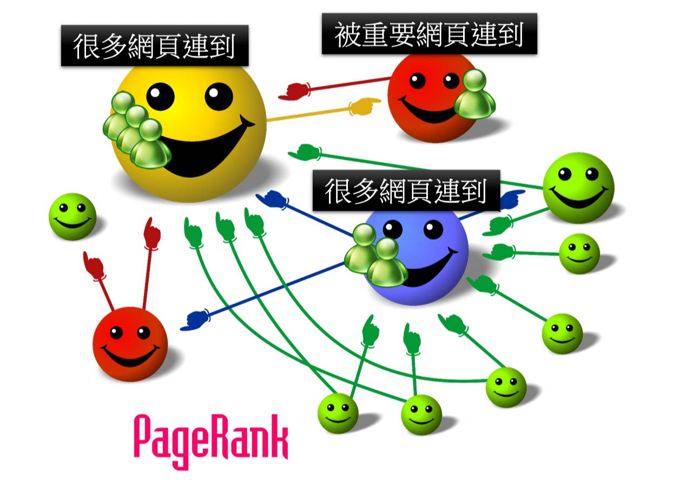

### Lec1

###### 线性系统的特征

系统：有一个输入，有一个输出，transform/function

* Presevering Multiplication
* Persevering Addition

###### 应用
* 电路学：整个电路就是一个系统，电压，电流源就是输入，负载上的电压和电流是输出。
* 信号与系统：Fourier Transorm其实也是Linear System，输入讯号，输出讯号。其实这两个讯号是同一个讯号，你只是在不同的观点来描述这个讯号
* Google的搜索
  
---
**PageRank**

每一个笑脸代表一个网页。笑脸和笑脸之间他们有箭头连接在一起，这些箭头指的是：网页和网页之间的超链接

如果有一个网，被很多人link到，最后看这个网页的会特别多，或者某个网页被某个重要的网页链接到，那看它的人也会特别多。

---

### Lec2
 
System of Linear Equations：线性方程组

###### Some Terminology

* Domain
* Range 值域
* Co-domain 对应域

---

**Note**
**Co-domain跟Range的不同:首先值域比对应域还要小，值域一定是被对应域包含在里面。**

---

---

**Note**
one-to-one(一对一)的意思是也就是说没有两个input有一样的output。

Onto(映成):range等于Co-domain

---